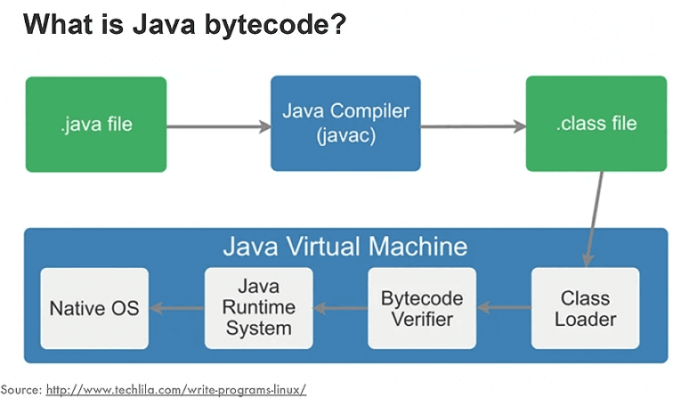

# Java

> Java is a multi-platform, object-oriented, and network-centric language that can be used as a platform in itself. It is a fast, secure, reliable programming language for coding everything from mobile apps and enterprise software to big data applications and server-side technologies.
Reference: https://aws.amazon.com/what-is/java/

---

- https://www.guru99.com/java-interview-questions-answers.html
- https://www.digitalocean.com/community/tutorials/java-multithreading-concurrency-interview-questions-answers#user-daemon-thread

## Java releases

[Top features of Java releases | JAVA_RELEASE.md](JAVA_RELEASE.md)

## Bytecode



[Reference](https://www.infoq.com/articles/Living-Matrix-Bytecode-Manipulation/)

When a Java program is compiled, bytecode is generated in the form of a .class file. This .class file contains non-runnable instructions and relies on a JVM to be interpreted.  In other words, bytecode can be defined as an intermediate code generated by the compiler after the compilation of source code. It's the instruction set for the Java Virtual Machine. [Reference](https://www.baeldung.com/java-class-view-bytecode)

The Java Virtual Machine is a virtual 'machine' that provides
a runtime environment for Java applications and programs*.
JVM is specifically responsible for converting bytecode to machine-specific code.

*Programs are collection of instructions executed by computer. Application are programs designed for end users.

---

***[Here you can find more details about JVM.](JVM.md)***

## Error hierarchy


[Reference](https://www.tutorialspoint.com/java/java_exceptions.htm)

### Error vs Exception

- Errors are fatal issues related to the system or JVM, and they are not meant to be caught or handled by applications.
- Exceptions are recoverable issues that can be handled and managed in the program’s code to improve its robustness and reliability.
- Exceptions are caused by the code of the application itself.
- `OutOfMemory` and `StackOverflow` are examples of errors.
- `IndexOutOfBounds` is an example of an unchecked exception, while `ClassNotFound` is an example of a checked exception.
- Reference: <https://www.educative.io/answers/what-is-the-difference-between-errors-and-exceptions-in-java>

### StackOverflowError vs OutOfMemoryError

- StackOverflowError: This error occurs when the stack space allocated for a thread is exhausted by deep or infinite recursion.
  - A StackOverflowError does not crash the entire JVM or other system processes, but it terminates the affected thread. If it happens in the main thread, the application will stop.
- OutOfMemoryError: This error occurs when the Java Virtual Machine (JVM) cannot allocate enough memory for an object because the heap space is exhausted.
  - OutOfMemoryError affects all threads within the same JVM, and in many cases, it can crash the entire JVM.
  - If heap memory is exhausted, all threads will fail to allocate objects, leading to application-wide failure.
  - If metaspace is exhausted, the application cannot load new classes, affecting frameworks like Hibernate or Spring.
  - Too many threads can prevent new threads from starting, causing the application to freeze.

### RuntimeException vs Checked Exception

- Java Exceptions are divided into two categories: RuntimeException also known as unchecked Exception and checked Exception.
- Main difference between RuntimeException and checked Exception is that tt is mandatory to provide try-catch or try finally block to handle checked Exception and failure to do so will result in a compile-time error, while in the case of RuntimeException this is not mandatory.
- Generally RuntimeExceptions are exceptions that can be prevented programmatically e.g NullPointerException, ArrayIndexOutOfBoundException.
    - If you check for null before calling any method, NullPointerException would never occur.
    - Similarly ArrayIndexOutOfBoundException would never occur if you check the index first.
- Ref: <https://www.java67.com/2012/12/difference-between-runtimeexception-and-checked-exception.html>

### Difference between using Throwable and Exception in a try catch? What is the best practise?

- Throwable: Not recommended for general exception handling as it catches all errors and exceptions, including serious issues like OutOfMemoryError.
- Exception: Suitable for handling all exceptions that a program might want to catch. However, catching specific exceptions is usually better practice.
- Best Practice: Catch the most specific exceptions possible, log exceptions appropriately, and avoid swallowing exceptions unintentionally. Use Error only in specific cases where handling is necessary (e.g., logging and graceful termination).
- Ref: <https://stackoverflow.com/questions/2274102/difference-between-using-throwable-and-exception-in-a-try-catch>

## Data types


- Primitive types are the most basic data types available within the Java language:
  - byte: 8-bit signed integer
  - short: 16-bit signed integer
  - int: 32-bit signed integer
  - long: 64-bit signed integer
  - float: 32-bit floating-point number
  - double: 64-bit floating-point number
  - char: 16-bit Unicode character
  - boolean: Holds either true or false
  - These aren't considered objects and represent raw values.
- Non-primitive data types (Reference variables) - such as String, Arrays and Classes (you will learn more about these in a later chapter).
  - Reference variables, on the other hand, do not hold data values directly. Instead, they hold references (or memory addresses) to objects in memory.

[Reference](https://www.geeksforgeeks.org/data-types-in-java/)

Every class in java implicitly extends java.lang.Object class. So Object class is at the top level of inheritance hierarchy in java. But primitive types do not inherit from Object since they're not classes. Ref: <https://stackoverflow.com/questions/26291463/does-every-data-type-inherit-from-object>

[Inheritance in Java Example](https://www.digitalocean.com/community/tutorials/inheritance-java-example)

---

JVM: Object references consume 4 bytes. boolean and byte values consume 1 byte. short and char values consume 2 bytes.

### Why do we need a wrapper class in Java?

- Required for Generic methods/classes, collections etc.
- Wrapper classes in Java are used to provide a way to use primitive data types (such as int, char, boolean, etc.) as objects.
    - Wrapper classes are immutable, meaning their values cannot be changed once they are created. This immutability can be useful in certain programming scenarios.
- The objects are necessary if we wish to modify the arguments passed into the method (because primitive types are passed by value).
- The classes in java.util package handles only objects and hence wrapper classes help in this case also.
- A primitive type is a predefined data type provided by Java. A Wrapper class is used to create an object; therefore, it has a corresponding class. A Primitive type is not an object so it does not belong to a class. The wrapper class objects allow null values.
- Ref:
    - <https://www.differencebetween.com/difference-between-wrapper-class-and-vs-primitive-type-in-java/>
    - <https://www.tutorialspoint.com/why-do-we-need-a-wrapper-class-in-java>

### What is autoboxing and unboxing?

- Autoboxing: Converting a primitive value into an object of the corresponding wrapper class is called autoboxing. For example, converting int to Integer class. The Java compiler applies autoboxing when a primitive value is:
    - Passed as a parameter to a method that expects an object of the corresponding wrapper class.
    - Assigned to a variable of the corresponding wrapper class.
- Unboxing: Converting an object of a wrapper type to its corresponding primitive value is called unboxing. For example conversion of Integer to int. The Java compiler applies unboxing when an object of a wrapper class is:
    - Passed as a parameter to a method that expects a value of the corresponding primitive type.
    - Assigned to a variable of the corresponding primitive type.
- Ref: <https://www.geeksforgeeks.org/autoboxing-unboxing-java/>

---

- What happens when you pass a primitive type when it requires a wrapper?
    - It is called autoboxing, and the compiler will convert your primitive into one of the wrapper classes. For example, an int will be automatically converted into an Integer (using temporary variables behind the scenes) which will make the code compilable.

### Internal String representation

In JDK 9, Oracle introduced a new internal representation for String to improve memory efficiency, particularly for ASCII-based strings. This optimization, known as **Compact Strings**, replaced the traditional char[] array with a byte[] array and a coder flag to indicate encoding.

- String Implementation Optimization (JDK 9)
   - Before JDK 9, Java stored Strings as char[], where each character occupied 2 bytes (UTF-16 encoding).
   - JDK 9 introduced byte[] instead of char[], reducing memory usage for ASCII strings.
   - A new coder flag was added:
     - ASCII Strings (ISO-8859-1 encoding) → Stored in byte[] (1 byte per character).
       - Non-ASCII Strings (UTF-16 encoding) → Stored in byte[] (2 bytes per character).
   - Benefits:
     - Memory Efficiency: Strings with only ASCII characters now use half the memory.
     - Performance Boost: Less heap space usage and lower garbage collection overhead.

## Java Control Statements

- if else, switch, for loop, while, do while
- Ref: <http://th-www.if.uj.edu.pl/zfs/ciesla/main/Java.html>

## Java access modifiers

In Java, access modifiers are keywords used to define the visibility or accessibility of classes, methods, variables, and constructors. They determine who can access these members and from where. Java provides four access modifiers, each providing a different level of access control.

- public:
  - Visibility: Members marked as public are accessible from any other class, regardless of the package they belong to.
  - Use case: Use public for methods and fields that need to be accessed globally across different classes, packages, or modules.
- protected:
  - Visibility: Members marked as protected are accessible within the same package and by subclasses (even if the subclass is in a different package).
  - Use case: Typically used when you want a class or field to be available to classes that are logically related (e.g., subclasses or classes within the same package), but not necessarily to all classes.
- Package-private (default):
  - Visibility: If no access modifier is specified (i.e., the default), the member has package-private visibility. This means the member is only accessible within the same package.
  - Use case: Typically used when you want to limit access to a field or method to other classes within the same package, but you don't want to make it public.
- private:
  - Visibility: Members marked as private are only accessible within the same class. They are not visible to subclasses or any other class, even if it's in the same package.
  - Use case: Used for encapsulation. It allows you to hide the internal implementation details of a class and only expose what's necessary through public or protected methods.
- Ref: <http://th-www.if.uj.edu.pl/zfs/ciesla/main/Java.html>

## Object identity

Objects in java are characterized by three essential properties: state, identity, and behavior:
- The state of an object is a value from its data type.
- The identity of an object distinguishes one object from another.
- It is useful to think of an object’s identity as the place where its value is stored in memory.

The state of an object is stored in fields (variables),
while methods (functions) display the object's behavior.
Objects are created at runtime from templates, which are also known as classes.

[Reference1](https://stackoverflow.com/questions/45453376/what-does-object-identity-mean-in-java)
[Reference2](https://www.techopedia.com/definition/24339/java-object)

## String pool

String Pool in java is a pool of Strings stored in Java Heap Memory. It is only possible because String is immutable in Java.

String pool is also example of Flyweight design pattern. String pool helps in saving a lot of space for Java Runtime, although it takes more time to create the String. When we use double quotes to create a String, it first looks for String with the same value in the String pool, if found it just returns the reference else it creates a new String in the pool and then returns the reference. However, using new operator, we force String class to create a new String object in heap space.

Ref: https://www.digitalocean.com/community/tutorials/what-is-java-string-pool

## Is Java "pass-by-reference" or "pass-by-value"?

- Java always passes arguments by value, NOT by reference.
- In Java, arguments are always passed by value, including object references.
- The terms "pass-by-value" and "pass-by-reference" are talking about variables. Pass-by-value means that the value of a variable is passed to a function/method. Pass-by-reference means that a reference to that variable is passed to the function. The latter gives the function a way to change the contents of the variable.
- By those definitions, Java is always pass-by-value. Unfortunately, when we deal with variables holding objects we are really dealing with object-handles called references which are passed-by-value as well. This terminology and semantics easily confuse many beginners.
- Key Points
    - Pass-by-Value: Java always passes arguments by value. For primitives, this means passing a copy of the value. For objects, this means passing a copy of the reference.
    - Object References: When an object is passed to a method, the method receives a copy of the reference to the object. The method can use this reference to modify the object's internal state.
    - Reference Reassignment: Reassigning the reference inside the method does not affect the original reference. The original reference outside the method still points to the original object.
- Ref: https://stackoverflow.com/questions/40480/is-java-pass-by-reference-or-pass-by-value

## What are Java anti-patterns?

In Java programming (and software development in general), anti-patterns are common, ineffective solutions to recurring problems. These solutions seem right at first but lead to poor maintainability, performance issues, or other significant problems in the long run.

1. God Object
  - Problem: A single class that takes on too many responsibilities, often becoming large and complex. It tends to accumulate many fields and methods, making it hard to maintain or extend.
  - Solution: Follow the Single Responsibility Principle (SRP). Break down the class into smaller, more manageable classes, each with a single responsibility.
2. Singleton Abuse
  - Problem: Overuse of the Singleton pattern to restrict a class to only one instance, even when multiple instances would be better. This can lead to tight coupling and global state issues.
  - Solution: Consider alternatives such as dependency injection or a factory pattern. Only use Singleton when there's a clear need for it (e.g., database connections or logging).
3. Hard-Coding Values
  - Problem: Embedding literal values, such as strings, numbers, or file paths, directly in the code instead of using constants, configuration files, or environment variables.
  - Solution: Use configuration files, constants, or environment variables to store values that may need to change in the future. This improves flexibility and maintainability.
4. Excessive Use of null
  - Problem: Using null as a way to indicate absent or invalid data can lead to NullPointerExceptions and makes the code harder to understand.
  - Solution: Use Optional (Java 8 and above) or other approaches like null object pattern to handle the absence of data safely.
  - Example: Null returned from a method instead returning an empty collection/array
5. Overuse of synchronized
  - Problem: Overuse of the synchronized keyword in a program can lead to performance issues, such as unnecessary locking, deadlocks, and increased contention for resources.
  - Solution: Use more fine-grained synchronization (e.g., ReentrantLock) and consider alternatives like atomic classes (e.g., AtomicInteger) and concurrent collections.
6. Primitive Obsession
  - Problem: Overuse of primitive types (like int, String, boolean) instead of creating more meaningful value objects that better express the problem domain.
  - Solution: Use value objects or custom types to encapsulate related primitive values, making the code more readable and self-explanatory.
    ```java
    public void setAddress(String street, String city) {
        // Instead of using primitives like String, use a class Address
    }
    ```
7. Too Many Parameters
- Problem: Methods with too many parameters can become hard to read, maintain, and debug. It increases complexity and makes code less understandable.
- Solution: Consider using builder pattern, parameter objects, or varargs to reduce method signature complexity.
8. Tight Coupling
  - Problem: Classes that are too tightly coupled, meaning they depend heavily on each other. This reduces the flexibility of the system and makes testing harder.
  - Solution: Use dependency injection, interfaces, and loose coupling to ensure that classes are not overly dependent on each other.
9. Not Using Interfaces for Abstraction
  - Problem: Implementing concrete classes without using interfaces to abstract functionality. This reduces flexibility and makes code harder to extend and modify.
  - Solution: Use interfaces or abstract classes to decouple your implementation from the usage of the code.
10. Using Stream parallel in Java 8 for small number of elements (efficiency)
11. Use functional programming from Java 8 and don’t try to mix - have one methods which part of it is functional and the next one part is imperative.
12. Not taking advantage of ‘toString()’ - it is good to overwrite the method in order to achieve neat output.
13. Overwriting only ‘equals()’ without ‘hashCode()’
14. Use StringBuilder rather than StringBuffer, unless synchronization is required.
  - StringBuilder is not thread safe, and therefore avoids the synchronization overhead of StringBuffer.
15. Magic Numbers
  - Naming variables/methods using parameters types like: String nameString.
16. Inheritance hell
  - Do not write abstract classes for 1 specific case. Use composition instead.
17. Be careful with exceptions - do not catch NullPointerException or errors for instance!
18. Premature Optimization
  - Problem: Optimizing code for performance before it's necessary. This often leads to complicated code and can hurt maintainability, as it addresses problems that may not exist.
  - Solution: Focus on readability and clarity first, then profile and optimize only when performance bottlenecks are identified.
19. Not Using Generics Properly
  - Unchecked Type Casts when getting an element from a list
  - Using Raw Types
  - Using Object as a Type Parameter
  - Using Wildcards Too Much
  - Benefits of Using Generics Properly:
    - Type Safety
    - Better Readability and Maintenance

- References:
  - <https://javaantipatterns.wordpress.com/>
  - <https://www.javacodegeeks.com/2011/10/programming-antipatterns.html>

## What is Java serialization? Can a serializable object contain non-serializable objects?

- Serialization in Java is the process of converting an object into a byte stream so that it can be easily saved to a file, transmitted over a network, or stored in a database. This allows Java objects to be persisted or shared between different environments, such as different systems or JVMs.
- The main purpose of serialization is to:
  - Persist Objects: Save the state of an object to disk or database, and restore it later.
  - Communication: Send objects over a network (e.g., RMI or web services).
  - Distributed Systems: Exchange objects between distributed systems and servers.
- Java Serialization is a mechanism provided by the Java API to serialize objects into a byte stream and deserialize them back to objects. This is facilitated by the java.io.Serializable interface and the ObjectOutputStream and ObjectInputStream classes.
- Not every object in Java is serializable by default. For an object to be serializable, its class must implement the java.io.Serializable interface, which is a marker interface with no methods.
- Can a Serializable Object Contain Non-Serializable Objects?
  - Non-Serializable Fields: If an object contains fields that are not serializable, and these fields are not marked as transient, then the serialization will fail with a java.io.NotSerializableException.
- The Java Virtual Machine (JVM) associates a version number with each serializable class, and this version is represented by the serialVersionUID field. This serial version UID is a unique identifier for the serialized form of a class and helps ensure compatibility during the deserialization process.
- If a serializable class doesn't declare a serialVersionUID, the JVM will generate one automatically at run-time. However, it is highly recommended that each class declares its serialVersionUID as the generated one is compiler dependent and thus may result in unexpected InvalidClassExceptions.
  - When serialization is required?
    - Persisting Objects to Disk
    - Remote Method Invocation (RMI)
    - Session Management in Web Applications
    - Object Transmission in Messaging Systems
    - Configuration and Data Storage
- Ref: <https://www.infoworld.com/article/2072752/the-java-serialization-algorithm-revealed.html>

1. When to Update serialVersionUID
  - You should update the serialVersionUID when you make incompatible changes to your class. Incompatible changes are those that would prevent deserialization of objects serialized with an older version of the class. Examples include:
    - Changing the type of a field that was serialized (e.g., changing an int to String).
    - Renaming fields (since the field name is part of the serialized data).
    - Changing the class hierarchy, such as altering or removing implemented interfaces, or changing the class’s superclasses.
  - If you update serialVersionUID, the JVM will treat the new version as a completely different class for deserialization, and objects serialized with the old version will not be deserialized.
2. When Not to Update serialVersionUID
  - You don’t need to update serialVersionUID if your changes are compatible with the previous version, meaning the object can still be deserialized successfully. Examples of compatible changes include:
    - Removing fields that were previously serialized.
    - Adding new fields (with default values or transient fields) that don’t break the logic of the class.
    - Changing methods that don’t affect the serialized form of the object.
    - Reordering fields (since the serialized form of an object is based on the field names, not the order).
  - In this case, if the class remains logically compatible with its previous versions, you can keep the same serialVersionUID.

## Java Time API (`java.time` - Java 8+)

The **Java Time API** (introduced in **Java 8**) is a modern replacement for the legacy `java.util.Date` and `java.sql.Timestamp`. It provides better **immutability, thread-safety,** and support for **time zones**.

| Class          | Description                                                                                   |
|----------------|-----------------------------------------------------------------------------------------------|
| Instant        | Represents an **exact timestamp** (UTC-based, nanosecond precision e.g. 1970-01-01T00:00:00Z. |
| LocalDate      | Represents a **date** (year, month, day) **without time**.                                    |
| LocalTime      | Represents a **time** (hour, minute, second) **without a date**.                              |
| LocalDateTime  | Represents **both date and time** (without a time zone).                                      |
| ZonedDateTime  | Represents a **date-time with a specific time zone**.                                         |
| OffsetDateTime | Similar to `ZonedDateTime` but with a **fixed UTC offset**.                                   |
| Duration       | Represents a **time-based amount** (e.g., "5 hours 30 minutes").                              |
| Period         | Represents a **date-based amount** (e.g., "2 years, 3 months").                               |
| ChronoUnit     | Used to measure time intervals (e.g., `ChronoUnit.DAYS`).                                     |

- java.sql.Timestamp
    - A thin wrapper around java.util.Date that allows the JDBC API to identify this as an SQL TIMESTAMP value.
- Date
    - No time data is kept. In fact, the date is stored as milliseconds since the 1st of January 1970 00:00:00 GMT and the time part is normalized, i.e. set to zero. Basically, it's a wrapper


### What's the difference between Instant and LocalDateTime?

- Instant represents a moment, a specific point in the timeline.
- LocalDateTime represents a date and a time-of-day. But lacking a time zone or offset-from-UTC, this class cannot represent a moment. It represents potential moments along a range of about 26 to 27 hours, the range of all time zones around the globe. A LocalDateTime value is inherently ambiguous.
- Ref: <https://stackoverflow.com/questions/32437550/whats-the-difference-between-instant-and-localdatetime>

### What is the difference between Instant and Timestamp? Instant.now() vs new Timestamp(System.currentTimeMillis())

- Instant and java.sql.Timestamp classes represent a point on the timeline in UTC. In other words, they represent the number of nanoseconds since the Java epoch.
- The Instant class from Java Date Time API models a single instantaneous point on the timeline in UTC. This represents the count of nanoseconds since the epoch of the first moment of 1970 UTC. Use Timestamp if you need to interface with SQL databases that require Timestamp objects, or if you're maintaining legacy code that uses the older java.sql API.
- Ref: <https://stackoverflow.com/questions/44476848/instant-differs-from-the-timestamp-in-java>

## inner class vs local class

Inner class:
```java
class OuterClass {
    private String outerField = "Outer Field";

    // Inner Class
    class InnerClass {
        void display() {
            System.out.println("Accessing outer class field: " + outerField);
        }
    }
    
    void createInner() {
        InnerClass inner = new InnerClass();
        inner.display();
    }
}

public class Main {
    public static void main(String[] args) {
        OuterClass outer = new OuterClass();
        outer.createInner();  // Output: Accessing outer class field: Outer Field
    }
}
```

Local class: 
```java
class OuterClass {
    void someMethod() {
        final String message = "Hello from Local Class!";
        
        // Local class inside method
        class LocalClass {
            void display() {
                System.out.println(message);  // Can access final local variable
            }
        }
        
        LocalClass local = new LocalClass();
        local.display();
    }
}

public class Main {
    public static void main(String[] args) {
        OuterClass outer = new OuterClass();
        outer.someMethod();  // Output: Hello from Local Class!
    }
}
```

## Polymorphism

Polymorphism in Java allows objects of different classes to be treated as objects of a common superclass.

---

In Java, polymorphism refers to the ability of a class to provide different implementations of a method, depending on the type of object that is passed to the method. To put it simply, polymorphism in Java allows us to perform the same action in many different ways. Ref: <https://www.mygreatlearning.com/blog/polymorphism-in-java/>

Types of Polymorphism in Java:
- Compile-time (Static) Polymorphism → Method Overloading
- Runtime (Dynamic) Polymorphism → Method Overriding
  - Both abstract classes and interfaces allow method overriding, which is resolved at runtime through dynamic method dispatch.
  - Interfaces and Abstract Classes provide additional ways to implement polymorphism.

What's an interface?
- Interface is a contract you should comply to or given to, depending if you are implementer or a user.
- In object-oriented programming, an interface generally defines the set of methods (or messages) that an instance of a class that has that interface could respond to. Interfaces are enabling abstraction, polymorphism, and flexible design by specifying a contract that classes must follow.
- Ref: <https://stackoverflow.com/questions/2866987/what-is-the-definition-of-interface-in-object-oriented-programming>

What's an abstract class?
- An abstract class in Java is a class that cannot be instantiated on its own. It serves as a blueprint for other classes by defining abstract methods (methods without implementation) that subclasses must override.

Example: Runtime Polymorphism (Method Overriding)
```java
// Parent class
class Animal {
    void makeSound() {
        System.out.println("Animal makes a sound");
    }
}

// Subclass 1
class Dog extends Animal {
    @Override
    void makeSound() {
        System.out.println("Dog barks");
    }
}

// Subclass 2
class Cat extends Animal {
    @Override
    void makeSound() {
        System.out.println("Cat meows");
    }
}

public class Main {
    public static void main(String[] args) {
        // Parent reference, different objects
        Animal myAnimal = new Dog();
        myAnimal.makeSound(); // Output: Dog barks

        myAnimal = new Cat();
        myAnimal.makeSound(); // Output: Cat meows
    }
}
```

- Method Overriding: The makeSound() method is overridden in both Dog and Cat.
- Dynamic Polymorphism: The method call is resolved at runtime based on the actual object type.
- Upcasting: Animal myAnimal = new Dog(); allows treating Dog as Animal, enabling flexibility.

## Class vs Object vs Instance

- A class is a blueprint which you use to create objects.
- An object is an instance of a class - it's a concrete 'thing' that you made using a specific class.
- So, 'object' and 'instance' are the same thing, but the word 'instance' indicates the relationship of an object to its class.
- Ref: <https://stackoverflow.com/questions/1215881/the-difference-between-classes-objects-and-instances>

## Covariance, Invariance and Contravariance

**Covariance (Subtype relationships)**

Covariance refers to a situation where a type preserves its subtype relationships when you assign it to a more general type. In Java, this is achieved using bounded wildcards (? extends T), where you can use any type that extends a specific class.

```java
class Animal {}
class Dog extends Animal {}
class Cat extends Animal {}

public class CovarianceExample {
    public static void main(String[] args) {
        List<? extends Animal> animals;  // Covariant: Can hold any subclass of Animal
        List<Cat> cats = new ArrayList<>();
        List<Dog> dogs = new ArrayList<>();
        
        animals = cats;  // List<Cat> is allowed because Cat is a subclass of Animal
        animals = dogs;  // List<Dog> is also allowed
    }
}
```

- List<? extends Animal> means any list of a subclass of Animal (including Cat and Dog).
- You can use List<Cat> or List<Dog> where List<? extends Animal> is expected.


**Invariance (No type relationships)**

Invariance refers to a situation where no subtype relationships are allowed. In other words, a List<Cat> is not a subtype of List<Animal>. This is the default behavior in Java generics.

```java
class Animal {}
class Dog extends Animal {}
class Cat extends Animal {}

public class InvarianceExample {
    public static void main(String[] args) {
        List<Cat> cats = new ArrayList<>();
        List<Animal> animals = new ArrayList<>();
        
        // animals = cats;  // ERROR! Cannot assign List<Cat> to List<Animal> because generics are invariant.
    }
}
```

- List<Cat> cannot be assigned to List<Animal> directly, even though Cat is a subclass of Animal.
- Java generics are invariant by default, meaning List<Cat> and List<Animal> are treated as completely unrelated types.

**Contravariance (Reverse subtype relationships)**

Contravariance refers to a situation where a type is reversed and allows a more general type to be assigned to a more specific type. In Java, this is achieved using wildcards with lower bounds (? super T), meaning that the list can hold objects of T or any supertype of T.

```java
class Animal {}
class Dog extends Animal {}
class Cat extends Animal {}

public class ContravarianceExample {
    public static void main(String[] args) {
        List<? super Cat> animals;  // Contravariant: Can hold Cat or any supertype of Cat
        List<Animal> animalsList = new ArrayList<>();
        
        animals = animalsList;  // List<Animal> is allowed because Animal is a supertype of Cat
    }
}
```

List<? super Cat> means that the list can hold Cat or any of its supertypes (e.g., Animal or Object).
You can use List<Animal> or List<Object> where List<? super Cat> is expected.

---

References
- <https://stackoverflow.com/questions/8481301/covariance-invariance-and-contravariance-explained-in-plain-english>
- <https://docs.microsoft.com/pl-pl/dotnet/csharp/programming-guide/concepts/covariance-contravariance/>
- <http://www.pzielinski.com/?p=946>

### super vs extends

- The first (<? super E>) says that it's "some type which is an ancestor (superclass) of E"; the second (<? extends E>) says that it's "some type which is a subclass of E". (In both cases E itself is okay.) Ref: <https://stackoverflow.com/questions/1368166/what-is-a-difference-between-super-e-and-extends-e>

## What is the purpose of Optional? What are advantages and disadvantages?

- Optional is a container object used to represent the presence or absence of a value. It is introduced in Java 8 as part of the java.util package. The purpose of Optional is to help deal with null references and avoid NullPointerException (NPE) by providing a more expressive and safer way to handle optional or missing values.
- Java 8's Optional was mainly intended for return values from methods, and not for properties of Java classes, as described in Optional in Java SE 8. Ref: https://stackoverflow.com/questions/29033518/is-it-a-good-practice-to-use-optional-as-an-attribute-in-a-class
    - If you want to point out the fact that some of these are nullable, and the rest of the code makes use of streams/optionals etc., you can make the getters return optionals.
- Disadvantages of Optional
    - Overhead:
        - Using Optional introduces additional overhead due to its wrapper nature, which might affect performance in high-throughput scenarios.
    - Not a Replacement for Null Checks Everywhere:
        - Optional is not meant to replace null checks in all scenarios. It is primarily used for cases where a value might be absent and should be handled explicitly.
    - Misuse:
        - Overusing Optional in inappropriate places, such as method parameters or collections, can lead to less readable and more complex code.

## What are Java Collections?

Java Collections is a framework that provides a set of interfaces and classes to store, manipulate, and manage groups of objects efficiently. It includes Lists, Sets, Queues, Maps, and utility classes for sorting, searching, and synchronization.

- Iterable/Collection (interface)
  - List <interface>
    - ArrayList
    - Vector (it is synchronized comparing to ArrayList)
    - LinkedList
  - Queue <interface>
    - LinkedList
    - PriorityQueue
  - Dequeue <interface>
    - LinkedList
    - ArrayQueue
  - Set <intercace>
    - HashSet
    - LinkedHasSet
  - SortedSet <interface>
    - TreeSet
  - Map (interface)
    - HashTable
    - HashMap
    - LinkedHashMap
      - Maintains order of keys
  - SortedMap <interface>
    - TreeMap
- Ref: <https://facingissuesonit.com/2019/10/15/java-collection-framework-hierarchy/>

### What are Java thread safe collections?

- Collections.synchronizedXxx()
  - Limitation: Only individual operations are synchronized, so iteration needs external synchronization.
  - Example: Collections.synchronizedList(new ArrayList<>())
- Concurrent Collections (java.util.concurrent Package)

| Collection Type | Thread-Safe Alternative | Best For                                                             |
|-----------------|-------------------------|----------------------------------------------------------------------|
| `ArrayList`     | `CopyOnWriteArrayList`  | Read-heavy tasks                                                     |
| `HashSet`       | `CopyOnWriteArraySet`   | Frequent reads, rare writes                                          |
| `HashMap`       | `ConcurrentHashMap`     | High-performance concurrent access. Does not block threads on reads. |
| `LinkedList`    | `LinkedBlockingQueue`   | Thread-safe queue with capacity                                      |
| `PriorityQueue` | `PriorityBlockingQueue` | Ordered elements in concurrent processing                            |
| `Queue`         | `ConcurrentLinkedQueue` | Fast, lock-free queue                                                |

Ref: <https://stackoverflow.com/questions/6045648/which-java-collections-are-synchronizedthread-safe-which-are-not>

### Dequeue vs queue

- A queue is designed to have elements inserted at the end of the queue, and elements removed from the beginning of the queue. Whereas Dequeue represents a queue where you can insert and remove elements from both ends of the queue.
- Ref: <https://stackoverflow.com/questions/38812225/queue-vs-dequeue-in-java>

### Stack vs Queue

- Stacks and Queues are always the most discussed data structures. This is because they both have opposite operations. Stack follows the pattern LIFO — Last In First Out whereas Queues uses FIFO — First In First Out. A common example of a Stack is a pile of plates while that of Queue is a queue at a bus station.
- Ref: <https://blog.sessionstack.com/how-javascript-works-stacks-and-queues-tips-for-efficient-implementation-8072a130380b>

### What is the difference between structure and collections?

- A data structure is a generic term for an object that represents some sort of data, so a linked list, array, etc are all data structures.
- A collection in the Java sense refers to any class that implements the Collection interface. A collection in a generic sense is just a group of objects.
- Data Structure in java is defined as the collection of data pieces that offers an effective means of storing and organising data in a computer. Linked List, Stack, Queue, and arrays are a few examples of java data structures.
- References
  - <https://www.mygreatlearning.com/blog/data-structures-using-java/>

### What is the difference between Map.of() vs new HashMap()? What is the difference between Map and HashMap?

- Map.of creates an immutable collection but new HashMap a mutable collection.
- HashMap is a non-synchronized class of the Java Collection Framework that contains null values and keys, whereas Map is a Java interface, which is used to map key-pair values.

## Project Loom

Project Loom introduces the concept of Virtual Threads to Java's runtime and will be available as a stable feature in JDK 21. [Reference](https://softwaremill.com/what-is-blocking-in-loom/)

*See more in code samples.*

## What is a producer-consumer problem? Do you know any Java’s library which solves the problem?

- The producer-consumer problem is a classic synchronization problem in concurrent programming. It involves two types of processes: producers and consumers, which share a common, finite-size buffer.
  The following are the problems that might occur in the Producer-Consumer:
    - The producer should produce data only when the buffer is not full. If the buffer is full, then the producer shouldn't be allowed to put any data into the buffer.
    - The consumer should consume data only when the buffer is not empty. If the buffer is empty, then the consumer shouldn't be allowed to take any data from the buffer.
    - The producer and consumer should not access the buffer at the same time.
- Java Libraries and Tools:
    - Java BlockingQueue Interface
        - Features:
            - Thread-safe: Handles synchronization internally.
            - Blocking operations: Provides blocking methods for adding and removing elements, which helps in managing the buffer’s state.
    - Java Semaphore Class
- Ref: <https://afteracademy.com/blog/the-producer-consumer-problem-in-operating-system>

## IO stream

In Java, IO Streams (Input/Output Streams) are a powerful mechanism for reading from and writing to different sources such as files, network connections, memory, or even the console. Java provides a rich set of classes for handling input and output operations, which are part of the java.io package.

### IO vs NIO

- Java IO: Provides a straightforward, blocking approach to file and stream operations. Suitable for simpler use cases and legacy systems.
- Java NIO: Offers a more flexible, non-blocking, and efficient approach to I/O operations, with support for advanced features like buffers, channels, and asynchronous I/O. Preferred for modern applications requiring high performance and scalability.

### IO stream kinds

- byte stream
  - InputStream (when you read)
  - OutputStream (when you write)
- character stream
  - Reader (when you read)
  - Writer (when you write)
- buffer stream
  - BufferedInputStream/BufferedOutputStream
  - BufferedReader/BufferedWriter
- binary stream
  - DataInputStream
  - DataOutputStream
- other
  - Scanner

### FileInputStream vs FileReader

- FileInputStream: Use this when you are dealing with binary files (such as images, videos, audio files) or if you want to manually handle the encoding of characters.
- FileReader: Use this when you are reading text files, where you want automatic character encoding handling and ease of use.

### getResourceAsStream() vs FileInputStream

- getResourceAsStream() loads a file via the classloader of classname. If the class came from a jar file, that is where the resource will be loaded from. FileInputStream is used to read a file from the filesystem.
- Ref: <https://stackoverflow.com/questions/2308188/getresourceasstream-vs-fileinputstream>

### How to load a file?

- `java.io.FileInputStream` is used for reading raw bytes from a file. It is suitable for binary files and can also be used for text files, but it requires manual handling of character encoding.
- The `java.nio.file.Files` class provides high-level methods for file operations, including reading file content into a String or byte[]. It is part of the NIO (New I/O) package and is often preferred for its simplicity and additional features.
- `java.io.BufferedReader` reads text from a file efficiently by buffering input, which reduces the number of I/O operations. Example: `try (BufferedReader br = new BufferedReader(new FileReader("path/to/your/file.txt")))`

## Java annotations

- Java Annotation is a tag that represents the metadata. Annotations allow you to attach additional information to code elements such as classes, methods, fields, parameters, or even entire packages. They are used to provide instructions to the compiler, to influence runtime behavior, or to generate code automatically.
- Java annotations are a way to add metadata to your Java code. This metadata provides additional information about the code and can be used by the compiler, runtime tools, or frameworks to perform various tasks. Annotations themselves do not alter the execution of your code directly but can influence the behavior of tools or frameworks that process them.
- Key Concepts of Java Annotation
  - Purpose:
    - Metadata: Provide metadata about the code, such as instructions to the compiler or information for runtime processing.
    - Configuration: Used for configuration purposes in frameworks and libraries, such as dependency injection and transaction management.
  - Syntax:
    - Annotations are declared using the @ symbol followed by the annotation name.
    - Example: @Override, @Entity, @Deprecated
- Built-In Annotations:
  - @Override: Indicates that a method is intended to override a method in a superclass.
  - @Deprecated: Marks a method or class as deprecated, meaning it should no longer be used.
  - @SuppressWarnings: Instructs the compiler to suppress specific warnings for the annotated element.
  - @SafeVarargs: Suppresses warnings about varargs usage.
- Custom Annotations:
  - You can define your own annotations using the @interface keyword.

## Java Future

The Future interface represents the result of an asynchronous computation. It provides methods to check the status of the computation, cancel it, and retrieve the result once it's finished.

```java
ExecutorService executor = Executors.newFixedThreadPool(1);
Future<Integer> future = executor.submit(() -> {
    return 42;  // Simulating some long-running computation
});

try {
    Integer result = future.get();  // Blocks until the result is ready
    System.out.println("Result: " + result);
} catch (InterruptedException | ExecutionException e) {
    e.printStackTrace();
} finally {
    executor.shutdown();
}
```

- FutureTask is a concrete implementation of the Future interface and is often used for wrapping tasks (usually Callable or Runnable) so they can be executed asynchronously. It can also be used to store the result of the task.
- FutureTask implements both Runnable and Future, which means you can pass it to an Executor for execution like a Runnable, and you can also use it to retrieve the result like a Future.

```java
Callable<Integer> task = () -> {
    Thread.sleep(2000);  // Simulate a delay
    return 42;
};

FutureTask<Integer> futureTask = new FutureTask<>(task);
ExecutorService executor = Executors.newFixedThreadPool(1);
executor.submit(futureTask);

try {
    Integer result = futureTask.get();  // Will block until result is available
    System.out.println("Result: " + result);
} catch (InterruptedException | ExecutionException e) {
    e.printStackTrace();
} finally {
    executor.shutdown();
}
```

CompletableFuture is a more advanced, flexible version of Future introduced in Java 8, and it implements the Future interface. What sets it apart from Future is that it supports asynchronous non-blocking operations and provides a more sophisticated API for handling complex scenarios, such as composing multiple tasks, chaining actions, and handling exceptions.

Key Features of CompletableFuture:
- Supports asynchronous programming.
- Allows you to combine multiple tasks using methods like thenApply(), thenAccept(), thenCombine(), etc.
- Has callback mechanisms for when the task is completed, either normally or exceptionally.
- Can be manually completed with the complete() method.
- Supports both synchronous and asynchronous completion styles.

### How to use Future and FutureTask?

- Future is an interface for managing the result of asynchronous tasks. The Future is a general concurrency abstraction, also known as a promise, which promises to return a result in the future.
- FutureTask is a concrete implementation that provides both the Future and Runnable functionality, allowing you to manage and execute tasks asynchronously while being able to retrieve results or handle exceptions.
- One of the simplest examples of using the Future is working with Thread pools. When you submit a long-running task to ExecutorService, it returns a Future object immediately.
- On the other hand, you can run a thread to run a FutureTask, e.g. `new Thread(futureTask).start();`
- References
  - <https://javarevisited.blogspot.com/2015/01/how-to-use-future-and-futuretask-in-Java.html#axzz6dHi6S700>
  - <https://stackoverflow.com/questions/4956822/whats-the-difference-between-future-and-futuretask-in-java>

## Concurrency

Concurrency means handling multiple tasks at the same time by switching between them efficiently. It doesn't necessarily mean running them simultaneously—just that they are making progress together.

Concurrency can be achieved with a single thread using techniques like asynchronous programming, event loops, and non-blocking I/O. The key idea is that a single thread can manage multiple tasks without waiting for one to finish before starting another.

## Multithreading

Multithreading is a programming technique that allows multiple threads (smallest units of execution) to run simultaneously within a single process. It enables Java programs to perform multiple tasks at the same time, improving efficiency and responsiveness.

### What are mutex, semaphore, monitor? What is locking in Java?

- A lock is a thread synchronization mechanism like synchronized blocks. They can be intrinsic (using synchronized blocks or methods) or explicit (using classes from java.util.concurrent.locks).
- A semaphore is a tool for synchronizing access to some resources. Similar to Mutex but allows multiple threads at the same time which can be configured. A Semaphore with count 1 is Mutex.
- A mutex is actually a semaphore with a count of 1. In other words, it's a semaphore that can accommodate a single thread. It's also known as a "binary semaphore" because its counter can have only 2 values — 1 ("unlocked") and 0 ("locked").
- In Java terminology a monitor is a mutex lock which is implicitly associated with an object. When the synchronized keyword is applied to classes or methods an implicit mutex lock is created around the code, which ensures that only one thread at a time can execute it. This is called a monitor lock or just a monitor.
  - Basically, Java uses the synchronized keyword to represent a monitor.
  - Monitors basically 'monitor' the access control of shared resources and objects among threads.
  - A monitor is a synchronization mechanism that allows threads to have: mutual exclusion – only one thread can execute the method.
- Mutual exclusion is a fundamental concept in concurrent programming and computer science that ensures that only one thread or process can access a shared resource or critical section of code at a time.
- References
  - <http://tutorials.jenkov.com/java-concurrency/locks.html>
  - <https://codegym.cc/groups/posts/220-whats-the-difference-between-a-mutex-a-monitor-and-a-semaphore>

### How you can synchronize methods?

- synchronized
  - public synchronized public methodA()
- internal synchronization
  - synchronized(this)
   ```java
     public void addName(String s) {
      synchronized(this) {
        name = s;
        counter++;
       }
      nameList.add(name);
   }
  ```
- fine-grained synchronization
  - private Object lock1 = new Object(); ... synchronized(lock1)
- JDK objects e.g. Lock, ReentrantLock

#### What is the difference between synchronized on lockObject and using this as the lock?

- Personally I almost never lock on "this". I usually lock on a privately held reference which I know that no other code is going to lock on. If you lock on "this" then any other code which knows about your object might choose to lock on it. While it's unlikely to happen, it certainly could do - and could cause deadlocks, or just excessive locking.
- Other aspects:
  - Fine-Grained Locking: Using a dedicated lock object allows you to have more control over locking granularity. You can synchronize on different lock objects to limit the scope of contention to only the relevant parts of your code.
  - Encapsulation: By using a private lock object, you can encapsulate the locking mechanism within the class, reducing the risk of external code synchronizing on your locks.
  - Flexibility: You can use multiple lock objects to create more complex locking strategies or to segregate access to different parts of your class.
  - Additional Complexity: Managing multiple lock objects requires careful design to avoid issues such as deadlocks or unintended interactions.
- Ref: <https://stackoverflow.com/questions/3369287/what-is-the-difference-between-synchronized-on-lockobject-and-using-this-as-the>

### What are typical problems related to thread?

- Race Conditions:
    - Occurs when multiple threads access shared resources (e.g., variables, data structures) without proper synchronization, causing unpredictable results or data corruption.
    - Example: Two threads incrementing a shared counter without synchronization may result in incorrect values.
    - Solution: Use synchronization mechanisms like synchronized blocks, AtomicInteger, or ReentrantLock.
        - A reentrant lock is one where a process can claim the lock multiple times without blocking on itself. It's useful in situations where it's not easy to keep track of whether you've already grabbed a lock. If a lock is non re-entrant you could grab the lock, then block when you go to grab it again, effectively deadlocking your own process.
- Deadlocks:
    - Happens when two or more threads are blocked forever, waiting for each other to release resources, thus causing a system to freeze.
    - Example: Thread A holds a lock on resource 1 and waits for resource 2, while Thread B holds a lock on resource 2 and waits for resource 1.
        - https://www.javatpoint.com/deadlock-in-java
    - Solution: Use proper lock ordering, or utilize tryLock() from ReentrantLock to avoid indefinite waiting.
        - Lock ordering is a technique used to prevent deadlocks when multiple locks are acquired in a program. It involves ensuring that locks are always acquired in a specific, consistent order across all threads.
- Starvation:
    - Low-priority threads are starved and never get the CPU time they need because higher-priority threads are continually executing.
    - Example: A low-priority thread constantly has its work preempted by high-priority threads.
    - Solution: Use fair locks or adjust thread priorities to ensure that every thread gets a chance to execute.
        - The ReentrantLock constructor allows enabling fairness with true as a parameter. Since we used new ReentrantLock(true), threads acquire the lock in FIFO (first-in, first-out) order.
- Thread Safety:
    - Inadequate synchronization when accessing shared resources can lead to thread safety issues, where multiple threads modify shared data inconsistently.
    - Example: Modifying a shared ArrayList from multiple threads without synchronization could lead to corruption of the list.
    - Solution: Use thread-safe collections like CopyOnWriteArrayList, ConcurrentHashMap, or wrap existing collections with Collections.synchronizedList().
- Context Switching Overhead:
    - Frequent switching between threads due to too many threads in the system can reduce performance.
    - Example: If a system has hundreds of threads competing for CPU time, the overhead of switching between them can cause performance bottlenecks.
    - Solution: Use thread pooling via ExecutorService, which reuses threads from a pool to handle tasks, minimizing context switching.

#### Thread Starvation and Fairness

- Thread Starvation: Occurs when a thread is perpetually denied access to resources because other threads keep acquiring them. This often results from improper scheduling or resource management, causing certain threads to never get a chance to execute.
- Fairness: Refers to ensuring that all threads have an equal opportunity to access resources and execute. Fairness can help prevent thread starvation and ensure that no thread is indefinitely delayed or denied access.
- Key Concepts:
    - Starvation Prevention: Implement strategies to prevent thread starvation by ensuring that all threads get a fair chance to execute. This can involve using fair locks or ensuring balanced resource allocation.
    - Fair Locks: Locks that ensure that threads acquire the lock in the order they requested it, preventing any thread from being indefinitely blocked. Java's ReentrantLock can be instantiated with a fairness policy to provide fair locking.
        - `ReentrantLock lock = new ReentrantLock(true); // Fair lock`
        - You cannot configure a ReentrantLock to allow multiple threads to access a critical section simultaneously. The primary purpose of a ReentrantLock is to provide mutual exclusion, which means that only one thread can hold the lock at a time and access the critical section of code that the lock guards.
    - Thread Scheduling: The underlying operating system and Java Virtual Machine (JVM) scheduler manage thread scheduling. Implementing fair policies within your application can help mitigate starvation.
    - Fair Queues: Use fair queue implementations like ArrayBlockingQueue with fair mode.
    - Concurrency Utilities: Use Java concurrency utilities with fairness options, such as Semaphore and CountDownLatch.
      - CountDownLatch is a synchronization aid in java.util.concurrent that allows one or more threads to wait until a set number of operations complete.
      - new CountDownLatch(3), meaning 3 tasks must complete.
- Ref: <https://www.logicbig.com/tutorials/core-java-tutorial/java-multi-threading/thread-starvation.html>

#### If a deadlock will be removed by releasing all resources, what could happen?

- Starving, dynamic deadlock again.

### Why should I set Xss parameter when running Java?

- Each thread in a Java application has its own stack.
- The stack is used to hold return addresses, function/method call arguments, etc.
- So if a thread tends to process large structures via recursive algorithms, it may need a large stack for all those return addresses and such.
- When Java creates a new thread, it pre-allocates a fixed-size block of memory for that thread's stack. By reducing the size of that memory block, you can avoid running out of memory, especially if you have lots of threads - the memory saving is the reduction in stack size times the number of threads.
- Thread stack vs JVM stack
  - Thread Stack: Each Java thread has its own stack for method calls, local variables, and recursion. It's used for executing Java code.
  - JVM Stack: This is an internal stack used by the JVM for managing its own operations, including native code execution, class loading, and JNI calls.
- Other aspects
    - Purpose of -Xss Parameter: Controls the stack size allocated to each thread in the JVM.
    - Use Cases: Helps manage deep recursion, large method frames, and optimize resource utilization.
    - Configuration: Adjust stack size as needed based on application requirements and performance considerations.
- Ref: <https://stackoverflow.com/questions/2623453/why-reduce-the-size-of-the-java-jvm-thread-stack>

### How do you test multithreading objects?

- Use different configuration: one thread, the same number of threads as number of threads, more threads than CPU cores.
- Testing for Race Conditions and Deadlocks: Use stress and load testing, and tools for deadlock detection.
- Best Practices: Use atomic operations, avoid long-running tasks in tests, and ensure reasonable test execution times.
- Timing and Synchronization Testing: Implement tests with custom timing, CountDownLatch, and CyclicBarrier.
- Static Analysis: Use static analysis tools (e.g., FindBugs, PMD) to detect potential concurrency issues.
- Concurrency Testing Tools: Employ libraries like JMH and use JUnit’s @RepeatedTest for stress testing.

### Does multithreading always improve performance?

- No, multithreading does not always improve performance. In fact, it can sometimes make performance worse due to overhead like context switching, synchronization, and resource contention.
- Only if we wait for long tasks, CPU-intensive and I/O-bound tasks.
    - When tasks are computationally heavy and can be divided among multiple cores, multithreading can significantly improve performance.
    - Fork-Join
- It is important to realize that threading performance depends on many factors, including the calculation, the size of the input data, the hardware and the underlying operating system. Multi-threading will not always speed up a computation.
- Parallel streams work well for large collections but can be worse for small ones.
- When Multithreading Worsens Performance
    - Too Many Threads (Context Switching Overhead)
        - If too many threads are used, the CPU spends more time switching between them than doing actual work.
    - Synchronization Overhead (Lock Contention)
        - If multiple threads need to access shared data, synchronization can slow down execution.
    - Small Tasks with High Overhead
        - Parallelizing small, fast tasks can be slower than running them sequentially.

### What is the most difficult in doing multithreading?

- Concurrency Issues: Race conditions, deadlocks, and starvation.
- Synchronization: Proper management of locks and mutual exclusion.
- Communication: Handling thread communication and data consistency.
- Debugging: Challenges in reproducing and diagnosing concurrency issues.
- Performance: Optimizing thread contention and scalability.
- Memory Consistency: Ensuring visibility and avoiding stale data.
- Resource Management: Proper handling of thread lifecycle and resource allocation.
- Design Complexity: Balancing complexity with effective multithreaded design.

| Problem             | Description                                             | Solution                                             |
|---------------------|---------------------------------------------------------|------------------------------------------------------|
| Race Conditions      | Threads modifying shared data inconsistently           | Synchronization (e.g., `synchronized`, `AtomicInteger`) |
| Deadlocks            | Threads waiting on each other indefinitely              | Lock ordering, use `tryLock()` to avoid indefinite blocking |
| Starvation           | Low-priority threads never get a chance to execute      | Use fair locks, balance thread priorities             |
| Thread Safety        | Shared data corruption due to concurrent access         | Use `ConcurrentHashMap` or other thread-safe operations |
| Context Switching    | Too many threads reduce performance due to overhead     | Use thread pooling, adjust the number of threads appropriately |
| Debugging            | Bugs are hard to reproduce due to non-deterministic behavior | Use logging, thread dumps, and unit tests to capture issues |

#### How to solve problem of resource sharing?

- The problem which mutual exclusion addresses is a problem of resource sharing: how can a software system control multiple processes' access to a shared resource, when each process needs exclusive control of that resource while doing its work?
- In order to solve it, do:
    - use resources which can be read and lock for writing e.g. AtomicInteger,
    - increase number of available resources to be equals or greater than number of threads (if it makes sense),
    - others:
        - Synchronization: Use synchronized blocks/methods or ReentrantLock to ensure exclusive access to critical sections.
        - Concurrency Utilities: Use ReadWriteLock, Semaphore, or other concurrency utilities for managing resource access.
        - Atomic Operations: Utilize atomic classes for thread-safe operations on individual variables.
        - Deadlock Prevention: Use lock ordering, timeouts, and avoid nested locking to prevent deadlocks.
        - Concurrency Design: Minimize shared state, use thread-local storage, and design for concurrency.
        - Contention Management: Reduce lock granularity and consider lock-free data structures.
- Ref: <https://en.wikipedia.org/wiki/Mutual_exclusion>

#### What is a deadlock? How to prevent is?
    
- Deadlock describes a condition in which two or more threads are blocked (hung) forever because they are waiting for each other.
- In order to prevent:
    - Avoid Nested Locks
    - Global Lock Ordering: Always acquire locks in a predefined global order. This prevents circular wait conditions because threads will always acquire locks in the same order e.g. if two class methods use synchronized methods which requires 2 locks (nested locks), always lock1, lock2 - keep this order for both methods.
        - Don't hold several locks at once. If you do, always acquire the locks in the same order.
    - Try-Lock with Timeout
    - Do as little as possible when you hold the lock.
    - Avoid locks by using lock-free data structures (e.g. use a ConcurrentLinkedQueue instead of a synchronized ArrayList)
    - Ref: <https://stackoverflow.com/questions/16780937/tips-to-prevent-deadlocks-in-java>

### "implements Runnable" vs "extends Thread" in Java

- Both approaches allow you to create and run threads in Java, but using Runnable is generally preferred for better flexibility and code reusability.
- Runnable is the best choice for creating threads in real-world applications.
- Only extend Thread if you are customizing its behavior (e.g., overriding start() or adding more thread-specific properties).
- Runnable is an interface which represents a task that could be executed by either a Thread or Executor or some similar means. On the other hand, Thread is a class which creates a new thread. Implementing the Runnable interface doesn't create a new thread.
- Ref: <https://stackoverflow.com/questions/541487/implements-runnable-vs-extends-thread-in-java>

#### Runnable vs Callable

- Runnable: Suitable for tasks that do not return a result and where checked exceptions are not a concern.
    - Method: void run()
- Callable: Suitable for tasks that return a result or need to throw checked exceptions.
    - Method: V call() throws Exception
- Ref: <https://www.educative.io/answers/what-is-the-difference-between-runnable-and-callable-in-java>

### CountDownLatch vs. CyclicBarrier

Both `CountDownLatch` and `CyclicBarrier` are used in Java for thread synchronization, but they serve different purposes.


| Feature          | CountDownLatch                                   | CyclicBarrier                                 |
|-----------------|--------------------------------------------------|--------------------------------------------------|
| Purpose      | Allows one or more threads to wait for a set of other threads to finish | Allows multiple threads to wait for each other at a common barrier before proceeding |
| Resettable?  | No (Once the count reaches zero, it cannot be reused) | Yes (Can be reset and reused after all threads reach the barrier) |
| Typical Use Case | When a main task needs to wait for several subtasks to complete | When multiple threads must start together after reaching a common point |
| Number of Waiters | Main thread waits for worker threads to complete | All threads wait for each other |
| Triggered By | Calling `.countDown()` | All threads calling `.await()` |
| Example | Waiting for multiple services to initialize before starting the main application | Waiting for all players to be ready before starting a multiplayer game |

---


Use Case: A main thread waits for worker threads to complete before proceeding.

```java
import java.util.concurrent.CountDownLatch;

public class CountDownLatchExample {
  public static void main(String[] args) throws InterruptedException {
    CountDownLatch latch = new CountDownLatch(3); // Wait for 3 threads

    Runnable worker = () -> {
      System.out.println(Thread.currentThread().getName() + " finished task");
      latch.countDown(); // Reduce count by 1
    };

    new Thread(worker).start();
    new Thread(worker).start();
    new Thread(worker).start();

    latch.await(); // Main thread waits here until count reaches 0
    System.out.println("All tasks finished! Main thread continues.");
  }
}
```

### yield vs join vs sleep vs notify vs wait vs stop

- Yield
    - The yield() method of thread class causes the currently executing thread object to temporarily pause and allow other threads to execute.
- Sleep
    - Pauses the current thread for a specified time.
    - Resumes automatically after the sleep duration.
    - Does not release any locks.
- Wait
    - When we use the sleep() method, a thread gets started after a specified time interval, unless it is interrupted. For wait(), the waking up process is a bit more complicated. We can wake the thread by calling either the notify() or notifyAll() methods on the monitor that is being waited on.
    - Sleep() method belongs to Thread class. Wait() method releases lock during Synchronization. Sleep() method does not release the lock on object during Synchronization. Wait() should be called only from Synchronized context.
    - Makes a thread wait until another thread notifies it.
- Notify / NotifyAll
    - Use notifyAll() instead of notify() when you want to wake all threads that are in the waiting state. Similarly to the wait() method itself, notify(), and notifyAll() have to be called from the synchronized context.
- Join
    - Join method in Java allows one thread to wait until another thread completes its execution. In simpler words, it means it waits for the other thread to die.
- References:
    - <https://www.javatpoint.com/java-thread-yield-method>
    - <https://www.geeksforgeeks.org/java-concurrency-yield-sleep-and-join-methods/>
    - <https://www.geeksforgeeks.org/difference-between-wait-and-sleep-in-java>
    - <https://www.edureka.co/blog/join-method-java>

```java
class ThreadExample {
    private static final Object lock = new Object();
    private static boolean running = true;

    public static void main(String[] args) {
        Thread yieldingThread = new Thread(() -> {
            for (int i = 0; i < 3; i++) {
                System.out.println("Yielding Thread: Running...");
                Thread.yield(); // Suggests giving CPU time to others
            }
        });

        Thread sleepingThread = new Thread(() -> {
            try {
                System.out.println("Sleeping Thread: Sleeping for 2s...");
                Thread.sleep(2000);
                System.out.println("Sleeping Thread: Woke up!");
            } catch (InterruptedException e) {
                e.printStackTrace();
            }
        });

        Thread waitingThread = new Thread(() -> {
            synchronized (lock) {
                try {
                    System.out.println("Waiting Thread: Waiting...");
                    lock.wait(); // Releases lock, waits for notify
                    System.out.println("Waiting Thread: Notified!");
                } catch (InterruptedException e) {
                    e.printStackTrace();
                }
            }
        });

        Thread notifyingThread = new Thread(() -> {
            try {
                Thread.sleep(1000); // Ensure waitingThread starts first
                synchronized (lock) {
                    System.out.println("Notifying Thread: Sending notification...");
                    lock.notify();
                }
            } catch (InterruptedException e) {
                e.printStackTrace();
            }
        });

        Thread joiningThread = new Thread(() -> {
            System.out.println("Joining Thread: Running...");
            try {
                Thread.sleep(1500);
                System.out.println("Joining Thread: Done.");
            } catch (InterruptedException e) {
                e.printStackTrace();
            }
        });

        Thread stoppingThread = new Thread(() -> {
            while (running) {
                System.out.println("Stopping Thread: Running...");
                try {
                    Thread.sleep(500);
                } catch (InterruptedException e) {
                    e.printStackTrace();
                }
            }
            System.out.println("Stopping Thread: Stopped safely.");
        });

        // Start threads
        yieldingThread.start();
        sleepingThread.start();
        waitingThread.start();
        notifyingThread.start();
        joiningThread.start();
        stoppingThread.start();

        // Join the joining thread
        try {
            joiningThread.join(); // Main thread waits for joiningThread to finish
        } catch (InterruptedException e) {
            e.printStackTrace();
        }

        // Stop the stopping thread safely
        running = false;
    }
}
```

#### notify vs wait

- Purpose:
    - wait(): Causes the current thread to wait until another thread calls notify() or notifyAll() on the same object.
    - notify(): Wakes up one thread waiting on the object's monitor. Selects a random thread from the wait set of the object and puts it in the BLOCKED state. The rest of the threads in the wait set of the object are still in the WAITING state.
    - notifyAll(): o.notifyAll() wakes all of the threads that are blocked in o.wait() calls. The threads are only allowed to return from o.wait() one-by-one, but they each will get their turn. 
- Behavior:
    - wait(): Releases the monitor lock and waits.
    - notify(): Does not release the monitor lock; it only wakes up a waiting thread.
- Reacquisition of Lock:
    - wait(): The waiting thread must reacquire the monitor lock when it resumes.
    - notify(): The notified thread must reacquire the monitor lock to proceed.
- Effect:
    - wait(): Can cause a thread to wait indefinitely until notified.
    - notify(): Only affects one waiting thread, chosen arbitrarily.
- Reference: <https://www.tutorialspoint.com/importance-of-wait-notify-and-notifyall-methods-in-java>

### What is Thread pool?

- Java Thread pool represents a group of worker threads that are waiting for the job and reuse many times. In case of thread pool, a group of fixed size threads are created. A thread from the thread pool is pulled out and assigned a job by the service provider.
- Ref: <https://allegro.tech/2015/05/thread-pools.html>

#### What is Executor service?

- The Java ExecutorService is a construct that allows you to pass a task to be executed by a thread asynchronously.
- The executor service creates and maintains a reusable pool of threads for executing submitted tasks.
- The service also manages a queue, which is used when there are more tasks than the number of threads in the pool and there is a need to queue up tasks until there is a free thread available to execute the task.
- ExecutorService interface implementations:
    - ThreadPoolExecutor: Highly configurable thread pool with fine-grained control.
    - ScheduledThreadPoolExecutor: Supports scheduling of tasks with delays or periodic executions.
    - SingleThreadExecutor: Executes tasks sequentially with a single thread.
    - CachedThreadPool: Creates and reuses threads dynamically for many short-lived tasks.
    - FixedThreadPool: Maintains a fixed number of threads for executing tasks.
    - WorkStealingPool: Uses a work-stealing algorithm to optimize task execution.
        - Work-Stealing Algorithm: A strategy to balance workload among threads by allowing idle threads to "steal" tasks from other threads' queues.
- Ref: <https://dzone.com/articles/a-deep-dive-into-the-java-executor-service>

---

- Executors.newCachedThreadPool() versus Executors.newFixedThreadPool()?
    - In terms of resources, the newFixedThreadPool will keep all the threads running until they are explicitly terminated.
    - In the newCachedThreadPool Threads that have not been used for sixty seconds are terminated and removed from the cache.
    - Ref: <https://stackoverflow.com/questions/949355/executors-newcachedthreadpool-versus-executors-newfixedthreadpool>
- What is the difference between ExecutorService.submit and ExecutorService.execute?
    - As you see from the JavaDoc execute(Runnable) does not return anything.
    - However, submit(Callable<T>) returns a Future object which allows a way for you to programatically cancel the running thread later as well as get the T that is returned when the Callable completes. See JavaDoc of Future for more details
    - Ref: <https://stackoverflow.com/questions/18730290/what-is-the-difference-between-executorservice-submit-and-executorservice-execut#:~:text=The%20difference%20is%20that%20execute,to%20finish%20executing%2C%20with%20get%20>
- Advantages of Executors over new Thread?
    - Creating new threads is expensive. Because Executors uses a thread pool, you get to easily reuse threads, resulting in better performance.
    - Ref: <https://stackoverflow.com/questions/18496948/advantages-of-executors-over-new-thread>

### What is Java Fork-Join? What is ForkJoinPool?

- Fork-Join Framework: A parallel computing framework that uses the divide-and-conquer strategy to efficiently process tasks by breaking them into smaller subtasks.
- ForkJoinPool: An ExecutorService implementation optimized for Fork-Join tasks, utilizing a work-stealing algorithm to balance the load among threads.
    - Work-stealing in ForkJoinPool is an effective algorithm that enables efficient use of computer resources by balancing the workload across all available threads in the pool.
    - When a thread becomes idle, instead of remaining inactive, it will attempt to steal tasks from other threads that are still busy with their assigned work.
- RecursiveTask<T> and RecursiveAction: Abstract classes for defining tasks that return a result (RecursiveTask<T>) or do not return a result (RecursiveAction). You have to submit a task if you use ForkJoinPool.
- A parallel stream is using ForkJoinPool behind the scenes.
- Use Fork-Join Framework:
    - When the problem can be divided into smaller, independent subtasks.
    - For recursive algorithms and data processing with parallelizable tasks.
    - When there is significant computation that can benefit from parallelism.
    - For performance optimization in large-scale data or complex computations.
- Avoid Fork-Join Framework:
    - For simple or very short-lived tasks.
    - When tasks have high interdependence and require frequent synchronization.
    - For non-recursive tasks or when task management overhead is too high.
- References:
    - <https://www.baeldung.com/java-fork-join>
    - <https://stackoverflow.com/questions/54365130/how-to-use-forkjoinpool-in-spring-boot-async>

### How does work a synchronized keyword in Java?

The synchronized keyword in Java is used to ensure mutual exclusion when accessing a shared resource in a multi-threaded environment. It helps prevent thread interference and ensures that only one thread can access a particular block of code or method at a time.

Key Concepts of synchronized:
- Thread Safety: The primary purpose of synchronized is to make code thread-safe, meaning that it ensures consistent and correct results when multiple threads attempt to access shared resources concurrently.
- Mutual Exclusion (Mutex): When a method or block of code is marked as synchronized, it ensures that only one thread can execute it at a time. Other threads that attempt to execute the synchronized method or block will be blocked until the current thread finishes and releases the lock.
- Locking Mechanism: The synchronized keyword works based on a lock (or monitor) that is associated with an object. When a thread enters a synchronized block or method, it acquires a lock for the associated object. If another thread is already holding that lock, the second thread will have to wait until the lock is released.

> A monitor is an entity that possesses both a lock and a wait set. In Java, any Object can serve as a monitor.

> In computer programming, a mutual exclusion (mutex) is an object that prevents multiple threads from accessing the same shared resource simultaneously.

- For instance methods, the lock is associated with the instance of the object (this).
- For static methods, the lock is associated with the class itself (ClassName.class).


Ref: <https://jenkov.com/tutorials/java-concurrency/synchronized.html>

### How to handle InterruptedException?

`InterruptedException` in Java is a checked exception that is thrown when a thread is interrupted while it is in a waiting, sleeping, or blocking state. This exception serves as a mechanism for thread coordination and is used to notify a thread that it should stop what it is doing and potentially terminate its execution or perform some cleanup tasks.

- Propagating the InterruptException
- Restore Interrupt state on Thread
    - `Thread.currentThread().interrupt()`
- Or additionally:
    - Custom handling of Interrupt
- References:
    - https://stackoverflow.com/questions/3976344/handling-interruptedexception-in-java
    - https://stackoverflow.com/questions/2614473/does-it-make-sense-to-do-try-finally-without-catch

```java
public class InterruptStatusCheckExample {
    public static void main(String[] args) {
        Thread childThread = new Thread(() -> {
            try {
                System.out.println("Child thread started.");
                Thread.sleep(5000);
                System.out.println("Child thread completed work.");
            } catch (InterruptedException e) {
                System.out.println("Child thread was interrupted.");
            }
        });

        childThread.start();

        try {
            Thread.sleep(2000);
            childThread.interrupt();  // Interrupt the child thread
        } catch (InterruptedException e) {
            e.printStackTrace();
        }

        // Parent thread checks interrupt status
        if (childThread.isInterrupted()) {
            System.out.println("Parent thread noticed that child was interrupted.");
        }

        try {
            childThread.join();  // Wait for the child thread to finish
        } catch (InterruptedException e) {
            e.printStackTrace();
        }
    }
}
```

```text
Child thread started.
Child thread was interrupted.
Parent thread noticed that child was interrupted.
```

> If you call the interrupt() method on a thread, it does not directly cause an InterruptedException on its own. However, it sets the interrupt flag for the target thread. This flag can cause an InterruptedException if the target thread is performing certain blocking operations that respond to interruptions, such as Thread.sleep(), Object.wait(), or BlockingQueue.take().

How Thread.interrupt() Works:
- Interrupting a Thread:
  - When you call Thread.interrupt() on a thread, you set the interrupt flag of that thread to true.
  - This doesn't automatically stop the thread or immediately cause an exception. It simply signals the thread that it has been interrupted, and the thread can check for this flag and respond accordingly.
- Blocked Threads and InterruptedException:
  - If the interrupted thread is blocked (e.g., in Thread.sleep(), Object.wait(), BlockingQueue.take(), etc.), it will immediately throw an InterruptedException when it detects the interrupt flag is set.
- Non-Blocked Threads:
  - If the target thread is not blocked and is executing normal code, the interrupt() call will set the interrupt flag, but no exception will be thrown. It's up to the thread to check the interrupt flag and decide what to do.

### What errors might occur while using an iterator with a collection modified by other threads?

- ConcurrentModificationException:
    - This exception is thrown if a collection is structurally modified (i.e., elements are added, removed, or reordered) after the iterator is created, except through the iterator's own methods (remove, replace).
- Race Conditions:
    - Race conditions can occur if the logic that depends on the state of the collection is not correctly synchronized. This can result in unpredictable behavior or bugs that are difficult to reproduce.
- To avoid these issues, consider the following strategies:
    - Use Concurrent Collections:
        - Java provides thread-safe collections in the java.util.concurrent package, such as ConcurrentHashMap, CopyOnWriteArrayList, and ConcurrentSkipListSet. These collections handle concurrent modifications safely and do not throw ConcurrentModificationException.
    - Synchronization:
        - If you are using collections that are not inherently thread-safe (like ArrayList, HashSet), you can synchronize the code block where the collection is accessed or modified. This ensures that only one thread can access the collection at a time.
    - Use Collections.synchronizedCollection:
        - You can wrap a collection in a synchronized wrapper using Collections.synchronizedList, Collections.synchronizedSet, etc. This wrapper ensures that all access to the collection is synchronized.
    - If possible, avoid modifying the collection while iterating over it. Instead, collect changes in a separate list and apply them after the iteration is complete.

```java
import java.util.*;

public class ConcurrentModificationExample {
    public static void main(String[] args) {
        List<String> list = Collections.synchronizedList(new ArrayList<String>());
        
        // Add some initial elements
        list.add("A");
        list.add("B");
        list.add("C");

        // Thread 1: Iterator 1 modifies the collection
        Thread t1 = new Thread(() -> {
            Iterator<String> iterator1 = list.iterator();
            while (iterator1.hasNext()) {
                System.out.println(iterator1.next());
                list.add("D");  // This will trigger ConcurrentModificationException
            }
        });

        // Thread 2: Iterator 2 reads the collection
        Thread t2 = new Thread(() -> {
            Iterator<String> iterator2 = list.iterator();
            while (iterator2.hasNext()) {
                System.out.println(iterator2.next());
            }
        });

        t1.start();
        t2.start();
    }
}
```
- ConcurrentModificationException occurs when a collection is modified while it is being iterated over.
- Synchronized collections prevent multiple threads from modifying the collection at the same time, but they do not guarantee safe iteration from multiple threads.
- To avoid the exception, ensure that modifications to the collection and iteration are properly synchronized or use thread-safe collections like `CopyOnWriteArrayList`.

## What is the purpose of Java functional Interface (SAM)?

- SAM stands for Single abstract method.
- In Java, a functional interface is an interface that has exactly one abstract method.
- Functional interfaces are used to represent single-method behaviors, which can be implemented using lambda expressions or method references.
- They are a key concept in Java's functional programming features introduced in Java 8.
- Since a primitive type can’t be a generic type argument, there are versions of the Function interface for the most used primitive types double, int, long, and their combinations in argument and return types:
  - IntFunction, LongFunction, DoubleFunction: arguments are of specified type, return type is parameterized
  - ToIntFunction, ToLongFunction, ToDoubleFunction: return type is of specified type, arguments are parameterized
  - DoubleToIntFunction, DoubleToLongFunction, IntToDoubleFunction, IntToLongFunction, LongToIntFunction, LongToDoubleFunction: having both argument and return type defined as primitive types, as specified by their names
- Examples:
  - Creating a new thread with Runnable
  - ActionListener
  - Comparable
- References:
  - <https://www.geeksforgeeks.org/functional-interfaces-java/>
  - <https://www.tutorialspoint.com/what-are-the-sam-interfaces-in-java>
  - <https://www.baeldung.com/java-8-functional-interfaces>

### What are differences between Supplier, Consumer, Callable, Runnable, Function, BiFunction, Predicate?

- Use Supplier if it takes nothing, but returns something.
- Use Consumer if it takes something, but returns nothing.
- Use Callable if it returns a result and might throw (most akin to Thunk in general CS terms).
- Use Runnable if it does neither and cannot throw.
- Matrix:
  - Supplier       ()    -> x
  - Consumer       x     -> ()
  - BiConsumer     x, y  -> ()
  - Callable       ()    -> x throws ex
  - Runnable       ()    -> ()
  - Function       x     -> y
  - BiFunction     x,y   -> z
  - Predicate      x     -> boolean
  - UnaryOperator  x1    -> x2
  - BinaryOperator x1,x2 -> x3
- Ref: <https://stackoverflow.com/questions/29945627/java-8-lambda-void-argument/62434813#62434813>

## Why do I need to override the equals and hashCode methods in Java? What's hash collision?

- equals() compares object content for logical equality.
- hashCode() returns a hash value used by hash-based collections to store and retrieve objects efficiently.
- The hashCode() and equals() contract is defined in the Java Object class (which is the root class for all objects) and is enforced by Java collections.
- The contract states:
    - If two objects are equal according to the equals() method, they must have the same hash code.
    - If two objects are considered equal (obj1.equals(obj2) returns true), then obj1.hashCode() must be equal to obj2.hashCode().
    - If two objects have different hash codes, they are not required to be unequal according to equals(), but it improves performance.
        - Objects with different hash codes are likely to be placed in different buckets in a HashMap, improving performance.
- The Best Practice
    - Always override both equals() and hashCode() when your class will be used in hash-based collections like HashMap, HashSet, etc.
    - If you override one, you must override the other to maintain consistency.
    - Use utility methods like Objects.equals() and Objects.hash() to simplify the implementation and avoid errors.
- Different objects can have the same hash code. This situation is known as a hash collision. In Java, the hashCode method returns an integer value that is used to determine the bucket location in hash-based collections like HashMap and HashSet. Because there are a finite number of possible integer hash codes (2^32 possible values), it is inevitable that different objects will sometimes produce the same hash code.
- Ref: <https://stackoverflow.com/questions/2265503/why-do-i-need-to-override-the-equals-and-hashcode-methods-in-java>
- how do default Java HashMap and HashSet deal with duplicates?
    - A HashMap stores key-value pairs. If you attempt to put a key-value pair where the key already exists in the map, the old value associated with that key is replaced by the new value
        - If two keys are equal (as determined by equals()), then the new value replaces the old value.
    - A HashSet is a collection that does not allow duplicate elements. When you add an element to a HashSet, if an element already exists in the set (based on equals()), the element is not added again—it is effectively ignored.

## How Generic Types Are Checked in Java

In Java, generic types are used to specify the type of objects that a class, interface, or method can operate on, without committing to a specific type at compile time. The type of the argument is specified when the object is created, and the compiler ensures type safety by checking the types at compile time. This is known as static type checking.

---

Type erasure is the process that happens at compile-time in Java where generic type information is removed, and the type is replaced with its raw type (non-generic type) during the compilation phase. This allows for backward compatibility with legacy code that doesn't use generics.
- At compile time: Generics are replaced with their bounds (e.g., Object for T if there’s no upper bound, or a specific class or interface if there is an upper bound).
- At runtime: The JVM only sees the raw type (the type after type erasure), not the specific type parameters used during compilation.

The compiler enforces type safety, ensuring that the wrong type isn't passed or returned.

Example:  
ArrayList<T> is implemented using Object[] internally and performs explicit type checking at compile-time instead of runtime. Casting happens internally but is hidden from the user.

```java
ArrayList<String> list = new ArrayList<>();
list.add("Hello"); 
String s = list.get(0);  // No cast needed (Generics ensure compile-time safety)
```

```java
public class ArrayList<T> {
    private Object[] elementData;  // Uses Object array internally
    
    public void add(T e) {
        elementData[size++] = e;  // Stores element as Object
    }

    @SuppressWarnings("unchecked")
    public T get(int index) {
        return (T) elementData[index];  // Cast back to T (Unchecked cast)
    }
}
```

Why Type Erasure Happens:
- Backward Compatibility: Before generics were introduced in Java 5, there was no concept of generics. To maintain compatibility with older code (which doesn’t use generics), the generic type information is erased at runtime.
- Type Safety at Compile Time: The type checking is done at compile time to ensure type safety, but the generic type information is not required at runtime for performance and backward compatibility reasons.

Impact on Performance:
- Type erasure itself does not directly impact the runtime performance because the JVM operates with the raw types (non-generic types) after type erasure.
- However, here are some indirect implications for performance:
  - No generic type metadata at runtime: Since generics are erased at runtime, there is no need to store extra type information, which keeps the memory usage lower. This can be seen as a performance benefit.
  - Casting overhead: Since the generic types are erased and replaced with raw types, explicit casting is often required when working with generics (e.g., casting from Object to Integer). This can lead to additional runtime overhead if you're frequently casting objects.
- Limited reflection capabilities: The type information is erased at runtime, meaning that reflection can only access the raw types (not the parameterized types). If you're using reflection heavily to interact with generics, this can lead to limitations and a performance hit if you rely on reflection to figure out the actual type.

### Are Interfaces and Abstract Classes Erased as Well?

Yes, interfaces and abstract classes are subject to type erasure in Java's generic system, but with some important distinctions:
- Abstract Classes: When you use an abstract class as a generic bound, it is treated in the same way as any other class. The generic type is erased to the raw type (the abstract class or its superclass) during compilation. This means that at runtime, the type information for abstract classes will not be available.
- Interfaces: When you use an interface as a generic bound, the type parameter is also erased, just like with abstract classes. The interface will only exist in the compiled bytecode for compile-time checks. At runtime, the interface type is not directly available, but if you're working with reflection, you can still check if a class implements a specific interface.

---

Java generics do not generate separate classes for each generic type you use at runtime. The concept of type erasure means that generics do not result in multiple separate classes for each combination of types. Instead, only one class (or method) exists in the bytecode for all instances of that generic class or method, and the type information is erased at compile time.

Scenario: Interface with Multiple Implementations
```java
interface Drawable {
    void draw();
}

class Circle implements Drawable {
    public void draw() {
        System.out.println("Drawing Circle");
    }
}

class Square implements Drawable {
    public void draw() {
        System.out.println("Drawing Square");
    }
}

class Triangle implements Drawable {
    public void draw() {
        System.out.println("Drawing Triangle");
    }
}
```

```java
public class Drawer<T extends Drawable> {

    public void drawShape(T shape) {
        shape.draw();
    }
}
```

What Happens During Compilation and Type Erasure?
- Compilation:
  - During compilation, the Drawer<T> class will have type safety enforced by the compiler, ensuring that only Drawable objects (or its subclasses) can be passed as arguments.
  - However, once the code is compiled, the type T will be erased, and the class Drawer will only exist as Drawer with no reference to the specific type T. The type T will be replaced with Drawable (or Object, depending on the bound).
- Type Erasure:
  - At runtime, there is only one version of the Drawer class. It does not create different classes for each combination of T. So, whether you use Drawer<Circle>, Drawer<Square>, or Drawer<Triangle>, they all map to the same class Drawer.
  - The Drawer class will operate on the raw type Drawable (since T extends Drawable). All instances of Drawer<T> will be treated as if they are working with Drawable at runtime.
  - No separate classes are created for each T. There’s only one Drawer class that can operate on Drawable types.


If you have an interface and multiple implementations, you won’t get multiple classes generated for each combination of implementations. Instead, the generic class or method will operate on the erased type at runtime, leading to only one class per generic class definition, regardless of how many different types are used in the source code.

---

Summary:
- Interfaces and abstract classes used as bounds for generics are also subject to type erasure. At runtime, only the raw type remains.
- Type erasure does not affect performance significantly since no additional information is kept after compilation. However, casting and reflection might introduce slight overhead in some scenarios.
- The main performance impact comes from casting (when working with raw types) and reflection (when inspecting types dynamically).

---

- Summary
    - During compilation types are checked. Not in runtime so it doesn't have any impact on running the app.
    - Type erasure is the process by which the compiler removes generic type information and replaces it with appropriate casts and raw types. Here’s how it works:
        - Replacing Type Parameters:
            - The compiler replaces generic type parameters with their bounds or Object if the type parameter is unbounded.
            - For example, T in List<T> is replaced with Object if T is unbounded, or with the bound type if it is bounded.
        - Inserting Casts:
            - The compiler inserts type casts where necessary to ensure type safety.
            - For example, when retrieving elements from a List<String>, the compiler inserts a cast to String.
        - Removing Type Parameters:
            - The compiler removes all generic type information and uses the raw types instead.
            - For example, List<String> becomes List at runtime.
    - Performance Impact
        - No Runtime Overhead:
            - Since generic type information is removed at compile-time, there is no additional runtime overhead due to generics.
            - Generics do not introduce any new runtime structures or checks.
        - Compile-Time Safety:
            - Generics provide compile-time type safety, which can prevent runtime type errors. This can lead to more robust and maintainable code.
        - Type Casts:
            - The compiler-generated casts due to type erasure are checked at runtime. However, these casts are usually straightforward and do not introduce significant performance overhead.
    - Key Points
        - Compile-Time Type Checking: Generics provide type safety at compile-time, preventing many types of runtime errors.
        - Type Erasure: Generic type information is erased at runtime, and generics are translated to their raw types.
        - No Runtime Overhead: There is no additional runtime overhead due to generics, as all generic type information is removed during compilation.
        - Compatibility: Type erasure ensures backward compatibility with older versions of Java.

### Can you create a generic array in Java?

- When you write generic code, the JVM removes type information at runtime (type erasure). Since arrays in Java store runtime type information, creating an array of a generic type is not allowed to prevent runtime ClassCastException.
- Direct Generic Arrays: Java does not support the direct creation of generic arrays due to type erasure.
- Best Practice: Using List is generally the most flexible and type-safe approach for handling collections of generic types in Java.

Workarounds:
- Use ArrayList<T> Instead of Arrays
- Use Array.newInstance() with Reflection
- Use Object[] and Type Casting
```java
class Box<T> {
    private Object[] arr;
    
    public Box(int size) {
        arr = new Object[size];  // Allowed
    }

    public void set(int index, T value) {
        arr[index] = value;
    }

    @SuppressWarnings("unchecked")
    public T get(int index) {
        return (T) arr[index];  // Type casting required
    }
}

public class Main {
    public static void main(String[] args) {
        Box<String> box = new Box<>(5);
        box.set(0, "Hello");
        System.out.println(box.get(0));  // Output: Hello
    }
}
```

## What is the difference between lazy and eager initialization?

- With lazy initialization you crate instance only when it's needed and not when the class is loaded.
- Lazy initialization example:
  ```java
  class Foo {
    private volatile Helper helper = null;
    public Helper getHelper() {
      if (helper == null) {
        synchronized(this) {
          if (helper == null) {
            helper = new Helper();
          }
        }
      }
    return helper;
  }
  ``` 
- Ref: <https://stackoverflow.com/questions/8297705/how-to-implement-thread-safe-lazy-initialization>

### Why is `volatile` important for creating Singleton?

- The volatile keyword in the Singleton example ensures that changes made during the creation of the singleton instance are visible to all threads, providing efficient synchronization.
  - In a multithreaded environment, each thread can maintain a local cache of variables instead of always reading from the main memory. This caching improves performance but can lead to memory consistency errors when one thread updates a shared variable, but another thread does not see the updated value due to reading from its cache.
- Here’s a brief breakdown of how volatile addresses this problem:
  - Visibility of Changes:
    - The volatile keyword ensures that the instance variable is visible to all threads immediately after it is initialized. Without volatile, changes to the variable may not be visible to other threads due to caching or reordering optimizations performed by the JVM or CPU. This can lead to a scenario where one thread sees the instance as null even though another thread has already initialized it.
  - Prevents Reordering:
    - The Java Memory Model allows the JVM to reorder instructions for performance optimization. This means that the instance of the Singleton might be initialized in one thread, but another thread could see the reference to the instance before it is fully initialized. Marking the instance as volatile guarantees that the write happens-before the reference is used by any thread. This ensures that the Singleton object is fully initialized before any thread accesses it.
- References:
  - https://dev.to/tharindufdo/using-javas-volatile-keyword-effectively-a-closer-look-391l
  - https://stackoverflow.com/questions/11639746/what-is-the-point-of-making-the-singleton-instance-volatile-while-using-double-l


## What is reflection in Java?

Reflection is a feature in the Java programming language which provides a way to inspect and manipulate the runtime behavior of applications. For example, it's possible for a Java class to obtain the names of all its members and display them.


For example, say you have an object of an unknown type in Java, and you would like to call a 'doSomething' method on it if one exists. Java's static typing system isn't really designed to support this unless the object conforms to a known interface, but using reflection, your code can look at the object and find out if it has a method called 'doSomething' and then call it if you want to.

```java
Method method = foo.getClass().getMethod("doSomething", null);
method.invoke(foo, null);
```

You can also change the value of a private field in Java using reflection. Reflection allows you to inspect and modify fields, methods, and other members of a class, even if they are private or protected.

```java
import java.lang.reflect.Field;

public class Example {
    private String secret = "Original Value";

    public static void main(String[] args) throws NoSuchFieldException, IllegalAccessException {
        Example obj = new Example();

        // Access the secret field via reflection
        Field field = Example.class.getDeclaredField("secret");
        field.setAccessible(true); // Make private field accessible

        // Change the value of the private field
        field.set(obj, "New Value");

        // Print the modified field value
        System.out.println("Updated secret: " + obj.secret);  // Output: Updated secret: New Value
    }
}
```

References
- <https://www.oracle.com/technical-resources/articles/java/javareflection.html>
- <https://stackoverflow.com/questions/37628/what-is-reflection-and-why-is-it-useful>


## Stream

- A stream is a sequence of objects that supports various methods which can be pipelined to produce the desired result.
    - A stream is an abstraction that represents a sequence of elements supporting sequential and parallel aggregate operations.
- A stream is not a data structure instead it takes input from the Collections, Arrays or I/O channels.
    - Streams are not data structures. They do not store data. Instead, they operate on data sources (such as collections, arrays, or I/O channels) and provide methods to process the data.
- There are blocking (java.util.stream) and non-blocking (java.util.concurrent.Flow)
- Lazy Evaluation:
    - Stream operations are generally lazy, meaning computations are not performed until a result is needed. Intermediate operations are not executed until a terminal operation is invoked.
- Pipeline of Operations:
    - Intermediate Operations: Transform the stream into another stream (e.g., map, filter, distinct).
    - Terminal Operations: Produce a result or side effect (e.g., collect, forEach, reduce).
- Immutability:
    - Streams do not modify the underlying data source. Instead, they produce new streams with the results of the operations applied.

### Is it possible to reuse the stream? For example IntStream.range(1,10) and make filter then print two times?

- No, because an exception will happen. If you try, you will get `java.lang.IllegalStateException: stream has already been operated upon or closed`

### Stream#findAny() vs Stream#findFirst()

- findFirst() guarantees the first element based on the stream’s encounter order.
- findAny() does not guarantee any specific order and may return any element, which is particularly beneficial for parallel streams.
    - Performance:
        - In sequential streams, there is generally little performance difference between findAny() and findFirst().
        - In parallel streams, findAny() can be more efficient as it does not require maintaining encounter order and can return an element faster.
- Ref: <https://stackoverflow.com/questions/35359112/difference-between-findany-and-findfirst-in-java-8>

## What can you tell about storing money in Java? How to store currency in Java?

- The problem is precision/rounding errors of float/double!
- Float is of size 32 bits (4 bytes) while double is of size 64 bits.
- Continuous values are represented approximately in memory, and therefore computing with floats involves rounding errors. These are tiny discrepancies in bit patterns; thus the test e==f is unsafe if e and f are floats.
- It is an inherent limitation of how floating point values are represented in memory in a finite number of bits.
- Solving the problem:
    - BigDecimal and using rounding algorithm build in into BigDecimal
        - Float & Double are bad for financial (even for military use) world, never use them for monetary calculations. If precision is one of your requirements, use BigDecimal instead.
        - All floating point values that can represent a currency amount (in dollars and cents) can not be stored exactly as it is in the memory. So if we want to store 0.1 dollar (10 cents), float/double can not store it as it is, instead binary can store only a closer approximation value (0.100000001490116119384765625 in decimal)
    - In JDK 8, the java.money package was introduced as part of the JSR 354 (Java Specification Request) to handle monetary and currency operations more effectively. This package includes classes such as MonetaryAmount, CurrencyUnit, and MonetaryContext, which are designed to handle money in a more sophisticated way.
- Problems (storing in database)
    - I came with one - use String to store BigDecimal in Java as a String into the database. You have validation, for example @NotNull, @Min(10), etc...
- References
    - <https://stackoverflow.com/questions/960072/rounding-errors>
    - <https://www.javacodemonk.com/which-data-type-would-you-choose-for-storing-monetary-values-in-java-6692c78c>
    - <https://www.baeldung.com/java-money-and-currency>

## Enum

An enum (short for "enumeration") in Java is a special class type that represents a fixed set of constant values.

- Difference between private and package-private enum constructor
    - The constructor for an enum type must be package-private or private access.
    - If no access modifier is specified for the constructor of an enum type, the constructor is private.
    - Package private - if you put default access level on constructor (or any other method), then can be accessed only by classes from same package.
    - Enum Constants Are Predefined: In Java, the constants of an enum are defined at the time the enum is loaded (at compile-time), and the enum class itself manages the creation of these constants. By making the constructor private, you prevent external code from creating new enum instances, which ensures that only the predefined constants are used.
    - References
        - <https://stackoverflow.com/questions/18704909/java-difference-between-private-and-package-private-enum-constructor>
        - <https://stackoverflow.com/questions/18226420/how-to-create-a-class-with-a-package-private-constructor>
- Comparing Java enum members: == or equals()?
    - Both are technically correct. If you look at the source code for .equals(), it simply defers to ==.
    - I use ==, however, as that will be null safe.
    - Ref: <https://stackoverflow.com/questions/1750435/comparing-java-enum-members-or-equals>
- What is the difference between Enum and Constant Java class?
    - The primary advantage is type safety. With a set of constants, any value of the same intrinsic type could be used, introducing errors. With an enum only the applicable values can be used.
    - Enums have the ability to use them in switch statements. This allows arbitrarily complex enums to be used in a clean way without using instanceof, potentially confusing if sequences, or non-string/int switching values. The canonical example is a state machine.
    - Ref: <https://stackoverflow.com/questions/24812265/what-is-the-difference-between-enum-and-constant-java-class>

## Anonymous class vs inner anonymous class vs inner class? When to use inner classes?

- In Java, anonymous classes and inner anonymous classes are concepts related to defining classes without explicitly naming them.
- An Anonymous Inner Class is used to create an object that will never be referenced again. It has no name and is declared and created in the same statement. This is used where you would normally use an object's variable.
- Inner class refers to a class that is nested inside another class, and it can access the instance fields and methods of the enclosing class (unless it's a static inner class).
- When we say anonymous inner class, we mean that the inner class is defined without a name and typically used in an instantiation expression.
    - Anonymous Inner Class: A class defined inside another class (i.e., an inner class) without a name. It has the ability to access the outer class's instance fields and methods (unless it’s static).
    - Anonymous Class: A name-less class that can either be an inner class or simply a class defined inside a method or block of code, usually to implement an interface or extend a clas
- Ref: <https://stackoverflow.com/questions/355167/how-are-anonymous-inner-classes-used-in-java>

Example of Anonymous Inner Class:
```java
public class OuterClass {
    public void printMessage() {
        System.out.println("Message from outer class");
    }

    public static void main(String[] args) {
        OuterClass outer = new OuterClass();
        
        // Anonymous inner class
        Runnable runnable = new Runnable() {
            @Override
            public void run() {
                outer.printMessage();  // Accessing outer class method
            }
        };
        
        runnable.run(); // Output: Message from outer class
    }
}
```

Example of Anonymous Class:
```java
public class Example {
    public static void main(String[] args) {
        // Anonymous class implementing the Runnable interface
        Runnable runnable = new Runnable() {
            @Override
            public void run() {
                System.out.println("Runnable executed");
            }
        };
        
        runnable.run(); // Output: Runnable executed
    }
}
```

## What are Lambda Expressions? Lambda functions vs Anonymous classes

- A Lambda Expression in Java is a concise way to represent an anonymous function.
- Introduced in Java 8, Lambda Expressions are primarily used for functional programming and enable writing cleaner, more concise code for single-method interfaces (Functional Interfaces).
- Lambdas, also known as anonymous functions and closures, are blocks of code that can be passed around and executed later. Lambda expressions do not need a name, and they can be implemented right in the body of a method.
- An anonymous class in Java is a way to declare and instantiate a class simultaneously without giving it a name. Anonymous classes are often used to make inline implementations of interfaces or abstract classes, especially when the implementation is used only once and is relatively simple.
    - The term "anonymous class" can be a bit misleading because it implies the class has no name at all. While it's true that an anonymous class does not have an explicit, user-defined name, it still has an internal name assigned by the Java compiler. This internal name is not accessible or useful to the programmer in the way that a regular named class would be.
    - Example: If an anonymous class is defined inside a class named Example, the compiler might name it something like Example$1.
- When Should You Use Each?
    - Use Lambdas when working with Functional Interfaces (e.g., Runnable, Comparator, Function).
    - Use Anonymous Classes when implementing interfaces with multiple methods or needing an inner class with state.
- Ref: https://www.digitalocean.com/community/tutorials/how-to-use-lambdas-in-java

### What is method reference in Java?

- Method references are a special type of lambda expressions. They're often used to create simple lambda expressions by referencing existing methods.
- Examples
    - messages.forEach(StringUtils::capitalize);
    - createBicyclesList().stream().sorted(bikeFrameSizeComparator::compare);
    - numbers.stream().sorted(Integer::compareTo);
- Ref: <https://www.baeldung.com/java-method-references>

## What is JSR?

- JSR stands for Java Specification Request. It is a formal document that describes proposed specifications or changes to the Java platform
- It's all part of the Java Community Process, whereby interested parties can put forward their ideas for enhancements and (hopefully) have them taken up and acted upon. The process is detailed here.
- For example, the Bluetooth specification is tracked here and the definitive list is maintained here.
- Ref: <https://stackoverflow.com/questions/9901976/what-is-jsr-and-whats-its-use>

## Build tools

- Maven Scope for Lombok (Compile vs. Provided)
  - Lombok should be used at the provided scope (see the official docs).
  - The reason (as has been stated in the comments) is that lombok is a compile-time-only tool. That is, it is not needed at runtime at all.
  - By making the scope provided, you make the lombok libraries available to the compiler, but it is not a dependency of your compiled jar. Ref: <https://stackoverflow.com/questions/29385921/maven-scope-for-lombok-compile-vs-provided>
- What is a transitive dependency in Gradle?
  - In Gradle, a transitive dependency is a dependency that is indirectly required by your project through another dependency. This means that if your project depends on a library, and that library itself depends on other libraries, those other libraries are considered transitive dependencies for your project.
  - No, you do not have to explicitly provide transitive dependencies in your Gradle build script. Gradle handles transitive dependencies automatically based on the dependencies you declare.
  - Ref: <https://stackoverflow.com/questions/31731014/what-does-transitive-true-in-gradle-exactly-do-w-r-t-crashlytics>
- Maven optional dependency
  - In Maven, an optional dependency is a type of dependency that is not required by default for the primary functionality of your project but is included if needed. This concept is used to provide flexibility in managing dependencies and avoid including unnecessary libraries in the final artifact.
  - Example
    - Suppose you are developing a library called core-lib that provides core functionalities and optionally supports integration with various logging frameworks. You want to make the logging integration optional because not all users of core-lib will need logging support.
    ```
    <dependencies>
    <!-- Core library dependencies -->

    <!-- Optional logging framework -->
    <dependency>
        <groupId>org.apache.logging.log4j</groupId>
        <artifactId>log4j-core</artifactId>
        <version>2.17.1</version>
        <optional>true</optional>
    </dependency>
    </dependencies>
    ```
  - Ref: <https://medium.com/@danismaz.furkan/difference-between-optional-true-optional-and-scope-provided-scope-7404ec24fb59>

## Implementation puzzles

## Can I use try catch block without catch?

Yes, you can use a try block without a catch block, but only when using a finally block. This is often referred to as a "try-finally" block.

The try-with-resources statement ensures that resources such as files, database connections, or sockets are automatically closed after they are no longer needed, which is useful for resource management and avoiding resource leaks.

### Should I use `var` keyword in Java?

- The var keyword is only allowed when the type of the variable is already clear at compile-time.
- The var keyword was introduced in Java 10 as part of the local variable type inference feature. It allows the compiler to automatically infer the type of a variable based on its initializer expression, reducing the need to explicitly declare the type.
- When to Use var:
    - When the Type Is Obvious: `var list = new ArrayList<String>();`
    - Reduced Boilerplate: `var name = "John Doe";`
        - Boilerplate code refers to sections of code that are repetitive, verbose, and required in multiple places with little or no modification. It is often necessary for a program to function but does not contribute directly to the business logic.
    - When Dealing with Complex Data Structures: `var stream = list.stream();`
        - var can be particularly useful when working with complex, generic data structures like streams, collections, or complex method returns.
- When Not to Use var:
    - When the Type Isn't Clear:
        - Avoid using var when the type is not obvious from the initializer, as it can lead to ambiguity and decrease readability: `var value = getSomeValue();`
- Motivation for var keyword:
    - Remember, that the only purpose of using var, according to the design of the language (since JDK 10+) is to beautify the code and make it more readable.
- References
    - <https://stackoverflow.com/questions/50040439/should-i-use-var-in-java-10>
    - <https://stackoverflow.com/questions/63073153/var-keyword-in-java>
    - <http://openjdk.java.net/projects/amber/LVTIstyle.html>
    - <https://stackoverflow.com/questions/54021579/java-10-local-variable-type-inference-advantage>
    - <https://stackoverflow.com/questions/63073153/var-keyword-in-java>

### When to use LinkedList over ArrayList?

- A linked list can be used to implement a queue. The canonical real life example would be a line for a cashier.
- Both ArrayList and LinkedList are implementation of List interface in Java. Both classes are non-synchronized.
- ArrayLists are good for write-once-read-many.
- LinkedList is fast for adding and deleting elements, but slow to access a specific element. ArrayList is fast for accessing a specific element but can be slow to add to either end, and especially slow to delete in the middle.
- Ref: <https://stackoverflow.com/questions/644167/what-is-a-practical-real-world-example-of-the-linked-list>
- When to Use LinkedList?
    - Frequent Insertions/Deletions in the Middle or Beginning
        - If you frequently insert or delete elements at the start or middle, LinkedList is better since it does not require shifting elements.
        - Example: Implementing a queue where elements are added at the back and removed from the front (addLast() and removeFirst() → O(1)).
        - Why Removing the First Element Requires Shifting in ArrayList?
            - ArrayList in Java is backed by a dynamic array, meaning its elements are stored contiguously in memory. When you remove an element from the beginning (index 0), all subsequent elements must be shifted left to fill the gap.
    - When Memory Overhead Is Not a Concern
        - Since LinkedList stores two extra pointers (prev and next) per node, it consumes more memory than ArrayList.
    - When Large Resizing Costs Are a Concern
        - ArrayList dynamically resizes (usually by 1.5x when full), which can be costly. LinkedList avoids this but has its own trade-offs.
- When to Use ArrayList?
    - Fast Random Access (get(int index))
        - ArrayList is O(1) for accessing elements via index, whereas LinkedList is O(n) because it requires traversal.
    - Less Memory Overhead
        - ArrayList only stores elements, whereas LinkedList stores additional pointers.
    - When Iteration Performance Matters
        - ArrayList is cache-friendly (because elements are stored contiguously in memory), making iteration faster than LinkedList.
- Summary
    - Use ArrayList when random access and iteration speed are important.
    - Use LinkedList when frequent insertions/removals at the start or middle are required.

### HashSet vs LinkedHashSet

- A LinkedHashSet is an ordered version of HashSet that maintains a doubly-linked List across all elements.
- Use this class instead of HashSet when you care about the insertion order.
- Ref: <https://stackoverflow.com/questions/5080612/hashset-vs-linkedhashset>
- If order matters, use LinkedHashSet.
- If performance is critical, use HashSet.

```java
import java.util.LinkedHashSet;

public class LinkedHashSetExample {
    public static void main(String[] args) {
        LinkedHashSet<String> set = new LinkedHashSet<>();
        set.add("Apple");
        set.add("Banana");
        set.add("Mango");
        set.add("Apple"); // Duplicate, won't be added

        System.out.println(set); // Maintains insertion order
    }
}
```

```text
[Apple, Banana, Mango]
```

### HashMap vs LinkedHashMap

- If order matters, use LinkedHashMap.
- If performance is critical, use HashMap.

```java
import java.util.HashMap;

public class HashMapExample {
    public static void main(String[] args) {
        HashMap<Integer, String> map = new HashMap<>();
        map.put(3, "Banana");
        map.put(1, "Apple");
        map.put(2, "Mango");

        System.out.println(map); // No guaranteed order
    }
}
```

```text
{2=Mango, 1=Apple, 3=Banana}
```

```java
import java.util.LinkedHashMap;

public class LinkedHashMapExample {
    public static void main(String[] args) {
        LinkedHashMap<Integer, String> map = new LinkedHashMap<>();
        map.put(3, "Banana");
        map.put(1, "Apple");
        map.put(2, "Mango");

        System.out.println(map); // Maintains insertion order
    }
}
```

```text
{3=Banana, 1=Apple, 2=Mango}
```

### Why do you need BlockingQueue?

- Java BlockingQueue implementations are thread-safe. All queuing methods are atomic in nature and use internal locks or other forms of concurrency control. Java BlockingQueue interface is part of java collections framework and it's primarily used for implementing producer consumer problem.
- A BlockingQueue is a specialized queue designed for thread-safe communication between producer and consumer threads. It blocks threads when the queue is full (for producers) or when the queue is empty (for consumers), eliminating the need for manual synchronization.
- Problems Without BlockingQueue
    - If multiple threads try to produce and consume data using a normal Queue (like LinkedList or ArrayDeque), you'll face:
        - Race conditions (multiple threads modifying shared state unsafely).
        - Busy waiting (consumer repeatedly checks for new data, wasting CPU).
            - Busy waiting occurs when a thread keeps checking in a loop (polling) to see if a condition is met without yielding CPU resources. This wastes CPU cycles.
        - Complex synchronization (you'd have to use synchronized, wait(), notify() manually).
- BlockingQueue is used in Apache Kafka. See: <https://github.com/apache/kafka/commit/0a045d4ef7d67dbe35b8fd2e1c51df87af19a0ab>
- References
    - <https://www.baeldung.com/java-blocking-queue>

Example Without BlockingQueue (Manual Synchronization):
```java
import java.util.LinkedList;

class SharedQueue {
    private LinkedList<Integer> list = new LinkedList<>();
    private final int capacity = 5;

    public synchronized void put(int value) throws InterruptedException {
        while (list.size() == capacity) { // Wait if full
            wait();
        }
        list.add(value);
        notifyAll(); // Notify consumers
    }

    public synchronized int take() throws InterruptedException {
        while (list.isEmpty()) { // Wait if empty
            wait();
        }
        int value = list.removeFirst();
        notifyAll(); // Notify producers
        return value;
    }
}

public class ProducerConsumer {
    public static void main(String[] args) {
        SharedQueue queue = new SharedQueue();

        new Thread(() -> {
            try {
                for (int i = 0; i < 10; i++) {
                    queue.put(i);
                    System.out.println("Produced: " + i);
                    Thread.sleep(500);
                }
            } catch (InterruptedException e) {}
        }).start();

        new Thread(() -> {
            try {
                for (int i = 0; i < 10; i++) {
                    System.out.println("Consumed: " + queue.take());
                    Thread.sleep(1000);
                }
            } catch (InterruptedException e) {}
        }).start();
    }
}
```

Example With BlockingQueue (No Manual Synchronization Needed):
```java
import java.util.concurrent.*;

public class ProducerConsumerBlockingQueue {
    public static void main(String[] args) {
        BlockingQueue<Integer> queue = new ArrayBlockingQueue<>(5);

        new Thread(() -> {
            try {
                for (int i = 0; i < 10; i++) {
                    queue.put(i); // Blocks if full
                    System.out.println("Produced: " + i);
                    Thread.sleep(500);
                }
            } catch (InterruptedException e) {}
        }).start();

        new Thread(() -> {
            try {
                for (int i = 0; i < 10; i++) {
                    System.out.println("Consumed: " + queue.take()); // Blocks if empty
                    Thread.sleep(1000);
                }
            } catch (InterruptedException e) {}
        }).start();
    }
}
```

### Do you recommend asynchronous logging?

- Yes, asynchronous logging is generally recommended in many applications, especially those with high-performance or high-throughput requirements. Asynchronous logging can help improve the efficiency of your application by offloading the logging operations to a separate thread or thread pool, reducing the impact of logging on the application's main execution flow.
- Are there any downsides - yes - depending on the criticality of your logging and your implementation any of the following could occur - logs written out of sequence, log thread actions not complete before event actions complete. (Imagine a scenario where you log "starting to connect to DB" and you then crash the server, log event may never get written even though the event has occurred (!))
- Maybe its so fast that it deosn't even worth the effort - disagree. If yours is an "application" logic, and the only thing you do is write logs of the activity - then you will be orders of magnitude lower latency by offloading logging. If however you rely on a 5sec DB SQL call to return before logging 1-2 statements, the benefits are mixed.

---

Spring Boot does not use asynchronous logging by default. However, Spring Boot does support asynchronous logging, and you can easily enable it by configuring the logging system, specifically the logback configuration.

```xml
<configuration>

    <!-- Add the asynchronous appender -->
    <appender name="ASYNC" class="ch.qos.logback.classic.AsyncAppender">
        <appender-ref ref="CONSOLE"/>
        <appender-ref ref="FILE"/>
    </appender>

    <!-- Console appender for standard output -->
    <appender name="CONSOLE" class="ch.qos.logback.core.ConsoleAppender">
        <encoder>
            <pattern>%d{yyyy-MM-dd HH:mm:ss} - %msg%n</pattern>
        </encoder>
    </appender>

    <!-- File appender for log file -->
    <appender name="FILE" class="ch.qos.logback.core.FileAppender">
        <file>logs/app.log</file>
        <encoder>
            <pattern>%d{yyyy-MM-dd HH:mm:ss} - %msg%n</pattern>
        </encoder>
    </appender>

    <!-- Root logger configuration -->
    <root level="INFO">
        <appender-ref ref="ASYNC"/>
    </root>

</configuration>
```

### Is it a good practice to throw an exception in a constructor when an object cannot be created, e.g. parameters are invalid?

- Yes, it is. It can be considered as a good practice.
- Throwing exceptions in a constructor is not bad practice. In fact, it is the only reasonable way for a constructor to indicate that there is a problem; e.g. that the parameters are invalid.
- Ref: <https://stackoverflow.com/questions/6086334/is-it-good-practice-to-make-the-constructor-throw-an-exception/6086399>

When to throw an exception in a constructor:
- Invalid Parameters: If the parameters passed to the constructor do not meet the required preconditions or validation rules, it is appropriate to throw an exception to indicate an error. For example, if you're creating a Person object and the age is negative or the name is empty, throwing an exception makes sense.
- Object Initialization Failures: If there are any issues during the initialization of the object (such as failure to open a file, invalid data, etc.), an exception can be thrown to indicate the failure.

Types of Exceptions to Throw:
- IllegalArgumentException: If one or more arguments passed to the constructor are invalid.
- NullPointerException: If a required parameter is null.
- IllegalStateException: If the object cannot be created because it would be in an invalid state (e.g., an object needs some other resource to initialize properly).

Advantages:
- Prevents Invalid Objects: By throwing an exception when invalid data is passed to the constructor, you ensure that the object is always in a valid and expected state.
- Clear Error Reporting: The exception helps identify the exact problem, making it easier to debug and fix issues.
- Avoids Silent Failures: If invalid data is allowed into the object, the application may fail silently, causing harder-to-trace issues later.

Alternative Approaches:
- Builder Pattern: If the constructor has too many validation checks or parameters, consider using the Builder Pattern. This allows you to separate the validation and object creation logic and provides more flexibility for constructing valid objects.
- Factory Methods: Another approach is to use a factory method that handles validation before creating the object. This can give more control over the creation process and allow for custom error handling.

### Is it good to have static methods in service?

- It is not recommended, there are numerous reasons:
  - you can't replace CustomerService with a mock easily during tests (tools like PowerMock aside)
  - static methods do not participate in standard, proxy-based AOP (no transactions, security, custom aspects)
  - you can no longer use fancy injection techniques, like injecting HTTP request (request scoped) into singleton scoped services (poor design anyway, but...)
- Other remarks:
  - Static Methods in Service Classes: Generally not recommended due to issues with testability, flexibility, maintainability, and adherence to object-oriented principles.
  - Appropriate Use: Static methods are suitable for utility or helper functions that do not require instance-specific data or behavior.
  - Recommended Approach: Use instance methods and dependency injection for service classes to enhance testability, flexibility, and maintainability.
- Ref: <https://stackoverflow.com/questions/13256406/whats-the-harm-to-make-a-static-method-in-service-layer-spring-3>

## Miscellaneous

- How does a clone method work in Java? How do nested objects behave?
    - The clone method in Java provides a way to create a copy of an object, but its default behavior is to perform a shallow copy. To handle nested objects properly, you often need to implement a deep copy manually. While implementing Cloneable interface consider alternative approaches like copy constructors or factory methods for more control and flexibility in your object copying.
    - Object.clone() method has protected access, meaning it's visible to sub-classes and classes in the same package. You can override it and assigning `public` access modifier.
    - Ref: <https://www.digitalocean.com/community/tutorials/java-clone-object-cloning-java>
- Can interface have default and static methods?
    - Interfaces can have default methods with implementation in Java 8 on later.
    - Interfaces can have static methods as well, similar to static methods in classes.
    - Private methods (introduced in Java 9)
    - You can have multiple default, static, and private methods in an interface.
- Should I use == or equals to compare primitives like int?
  - == compares values for primitives.
    - You cannot use .equals() directly on primitives as int does not have .equals() method.
  - .equals() is a method for objects, not primitives.
- How can you compare objects in Java?
    - In Java, we can distinguish two kinds of equality.
        - Object reference equality: when two object references point to the same object.
        - Object value equality: when two separate objects happen to have the same values/state.
    - Others
        - equals(): Compares object contents based on logical equality. Override this method for custom logic.
        - == Compares object references to see if they point to the same memory location.
        - compareTo(): Used for natural ordering when implementing Comparable.
        - Comparator: Provides custom comparison logic for sorting or other comparisons.
        - Objects.equals(): Safely compares two objects, handling nulls.
        - Arrays.equals(): Compares arrays for equality.
- What are the performance implications of Interfaces over abstract classes?
  - If an abstract class has mostly abstract methods, its performance is similar to an interface due to dynamic dispatch.
  - If it has more concrete methods, it is more efficient due to direct method resolution.
  - The JVM still optimizes abstract class method calls better than interfaces because abstract classes follow a single inheritance model, making method resolution faster.
  - Rule of Thumb:
    - Use an abstract class when you can provide concrete implementations to improve performance. If most methods are abstract, the performance difference is minor compared to an interface.
- Difference between HashMap, LinkedHashMap and TreeMap
    - HashMap makes absolutely no guarantees about the iteration order. It can (and will) even change completely when new elements are added.
    - TreeMap will iterate according to the "natural ordering" of the keys according to their compareTo() method (or an externally supplied Comparator). Additionally, it implements the SortedMap interface, which contains methods that depend on this sort order.
    - LinkedHashMap will iterate in the order in which the entries were put into the map
    - Ref: <https://stackoverflow.com/questions/2889777/difference-between-hashmap-linkedhashmap-and-treemap>
- When static attributes are initialized? Are static variables initialized even a class is not used in the code?
    - Static variables are initialized when the class is first loaded by the JVM.
    - They are initialized in the order they are defined, before any static blocks or methods are executed.
    - If a class is not used or referenced in the code, its static variables are not initialized.
    - Static initialization occurs only once, no matter how many instances of the class are created.
- What is a raw type?
    - A raw type is a generic type used without specifying its type parameter. For example, before Java generics was available, you would use a collection class like this: LinkedList list = new LinkedList();
    - Using raw types results in loss of type safety, leading to potential runtime errors and the need for manual casting.
    - Ref: <https://stackoverflow.com/questions/2770321/what-is-a-raw-type-and-why-shouldnt-we-use-it>

```java
import java.util.*;

public class RawTypeExample {
    public static void main(String[] args) {
        // Raw type usage: using ArrayList without specifying the type parameter
        ArrayList list = new ArrayList();  // Raw type
        list.add("Hello");
        list.add(10);  // This is allowed with raw type, but not recommended
        
        // Attempting to access elements will cause a runtime exception if type is incompatible
        String firstElement = (String) list.get(0);  // Works fine
        String secondElement = (String) list.get(1);  // Throws ClassCastException at runtime
    }
}
```
- What is a generic class in Java?
    - It's a class with a type which can be specified e.g. ArrayList of a type String/Integer.
- What is the difference between String literals and String objects?
    - The main difference between String Literal and String Object is that String Literal is a String created using double quotes while String Object is a String created using the new() operator. String Literal - if the String exist in the String pool, the new reference is assigned to the already existing variable.
    - Ref: <https://pediaa.com/what-is-the-difference-between-string-literal-and-string-object-in-java/>
- If I synchronized two methods on the same class, can they run simultaneously?
    - Both methods lock the same monitor. Therefore, you can't simultaneously execute them on the same object from different threads (one of the two methods will block until the other is finished).
    - What is a Monitor Lock?
        - Each Java object has a monitor lock associated with it.
        - A monitor lock is an internal synchronization mechanism used to ensure that only one thread can execute a synchronized block or method at a time for a specific object.
    - Ref: <https://stackoverflow.com/questions/15438727/if-i-synchronized-two-methods-on-the-same-class-can-they-run-simultaneously>
- What Java libraries do you know?
    - org.apache.commons.lang3, Google Guava, Jackson, SLF4J, Mockito, Junit, Hibernate, Spring projects (security, data, cloud, hateoas, ...), HikariCp, Lombok, Vavr, Flyway/Liquibase, Swagger, Wiremock...
- Does the wildcard have an impact on performance? Is it good practice to use wildcards?
    - Wildcard imports tell a java compiler to search for class names in the given package. Hence, using wild card imports, the compile-time performance may lower a bit. But it won’t be a notable impact in most cases. In run time, there’s no performance issue at all because these import statements are compiler directives and we can’t find them in the byte code.
    - In my last project, we do not use wildcards because of name collisions and being aware of what is imported.
- What is Java's main thread?
    - When the JVM starts, it creates a thread called "Main". Your program will run on this thread, unless you create additional threads yourself.
    - The first thing the "Main" thread does is to look for your static void main(String[] argv) method and invoke it. That is the entry-point to your program.
    - If you want things to happen "at the same time", you can create multiple threads, and give each something to execute. They will then continue to do these things concurrently. The JVM also creates some internal threads for background work such as garbage collection.
    - The main thread is the thread that starts your program, or simply which runs your public static void main(String... args) method.
- What is the difference between StringBuffer vs StringBuilder?
    - StringBuffer is synchronized i.e. thread safe. It means two threads can't call the methods of StringBuffer simultaneously. StringBuilder is non-synchronized i.e. not thread safe. It means two threads can call the methods of StringBuilder simultaneously.
    - StringBuffer is less efficient than StringBuilder. StringBuilder is more efficient than StringBuffer.
    - Ref: <https://stackoverflow.com/questions/355089/difference-between-stringbuilder-and-stringbuffer>
- What is native function in Java?
    - It marks a method, that it will be implemented in other languages, not in Java. It works together with JNI (Java Native Interface).
    - Native methods were used in the past to write performance critical sections but with Java getting faster this is now less common. Native methods are currently needed when:
        - You need to call a library from Java that is written in other language.
        - You need to access system or hardware resources that are only reachable from the other language (typically C). Actually, many system functions that interact with real computer (disk and network IO, for instance) can only do this because they call native code.
    - While you can theoretically use languages like Go, Rust, Ruby, or JavaScript, they are not directly supported by JNI. You would typically need to use C/C++ as a bridge to interact with Java.
    - Thus, for most practical purposes, native functions in Java are usually written in C or C++. If you need to interface with other languages, it often involves additional layers or tools that allow communication through a common language (typically C/C++).
    - <https://stackoverflow.com/questions/6101311/what-is-the-native-keyword-in-java-for>
- What's JNDI?
    - JNDI, which stands for Java Naming and Directory Interface, is a Java API that provides naming and directory functionality. It allows Java applications to locate and access resources such as databases, enterprise JavaBeans (EJBs), messaging services, and other objects, using a unified interface.
    - JNDI is commonly used to configure and retrieve database connection pools in Java EE environments, enabling applications to access databases without hardcoding connection details.
      - In a Java EE environment, resources (like DataSources, EJBs, JMS Queues) are registered with the application server (Tomcat, WildFly, etc.) and can be looked up via JNDI.
- When should I use `this` in a class?
    - The `this` keyword is primarily used in three situations.
        - The first and most common is in setter methods to disambiguate variable references.
        - The second is when there is a need to pass the current class instance as an argument to a method of another object.
        - The third is as a way to call alternate constructors from within a constructor.
    - Ref: <https://stackoverflow.com/questions/2411270/when-should-i-use-this-in-a-class>
- What is wrong? ```void m1(String ..., String s)```
    - This is a wrong approach give syntax error. The argument that gets the ... must be the last in the method signature.
    - Varargs is a short name for variable arguments. In Java, an argument of a method can accept arbitrary number of values. This argument that can accept variable number of values is called varargs.
    - Some implementation details
      - The varargs parameter (String... values) is treated as an array inside the method.
      - Varargs is used when you want a method to accept any number of arguments of the same type.
      - You can access elements of the varargs parameter using array indexing (e.g., values[2] for the 3rd element).
      - Always ensure there are enough elements to access to avoid exceptions (e.g., checking values.length before accessing a specific index).
    - Ref: https://stackoverflow.com/questions/3158730/what-do-3-dots-next-to-a-parameter-type-mean-in-java
- What is `failure atomicity` used by Joshua Bloch? How is it beneficial in terms of immutable object?
    - Failure Atomicity is a concept described by Joshua Bloch in the context of designing robust and reliable APIs, particularly in the book Effective Java. It refers to the idea that if an operation on an object fails, the object should be left in a consistent state, as if the operation never occurred. This concept is particularly relevant when dealing with mutable objects but can also have implications for immutable objects.
    - Bloch's "Failure atomicity" means that if a method threw an exception, the object should still be usable afterwards. Generally, the object should be in the same state as it was before invoking the method.
        - For example, String has a substring(int) method. It does not change anything in the original string but it creates a new object whose content is a copy of the part of the original string that you wanted. If it throws an exception, then you simply won't get the new object - but the original String was never changed. There is no code inside substring() that modifies the original String and therefore, it is failure-atomic.
    - For immutable objects, failure atomicity is naturally achieved because an immutable object either gets fully created or not created at all.
    - Ref: <https://stackoverflow.com/questions/29842845/what-is-failure-atomicity-used-by-j-bloch-and-how-its-beneficial-in-terms-of-i>
- What is jps -l ?
    - The jps command is a utility provided with the Java Development Kit (JDK) that lists the Java processes running on a machine.
- @NotNull javax annotation vs Intellij @NotNull annotation vs Lombok @NotNull
    - @NotNull (javax.validation.constraints): Used for bean validation. The validation is enforced by validation frameworks and does not generate runtime checks by itself.
    - @NotNull (IntelliJ IDEA): Used by IntelliJ IDEA for static code analysis. It does not provide runtime null checks and is primarily for IDE support.
    - @NonNull (Lombok): Generates runtime null checks to ensure that fields and method parameters are not null. Throws NullPointerException if a null value is encountered.
- Does order matter for static variables?
    - Yes, if one of them is using another, the one used by another variable should be written before.
- How to initialize a list in one line?
    - ``Arrays.asList("Buenos Aires", "Córdoba", "La Plata");``
    - Ref: https://stackoverflow.com/questions/1005073/initialization-of-an-arraylist-in-one-line
- How is dependency injection done in Java?
    - Dependency Injection (DI) is a design pattern in software development that allows you to inject dependencies (objects or services) into a class rather than creating those dependencies inside the class itself.
      - Dependency injection can be performed on:
        - the constructor of the class (construction injection)
        - a field (field injection)
        - the parameters of a method (method injection) or setters (setter injection)
    - Ref: <https://www.vogella.com/tutorials/DependencyInjection/article.html>
- What is a @Transient annotation and transient Java keyword?
    -  In the context of Java Persistence API (JPA) and Hibernate, the @Transient annotation is used to mark fields in an entity class that should not be persisted in the database. It tells the persistence provider to ignore these fields when performing database operations such as saving or loading entities.
    - The transient keyword is used in Java to indicate that a field should not be serialized when an object is converted into a byte stream (e.g., during object serialization). This means that when an object is serialized, the transient fields are excluded from the serialized form. Conversely, when deserializing the object, transient fields are not restored, and their values are set to the default values (e.g., null for objects, 0 for integers).
    - Ref: <https://javabydeveloper.com/transient-annotation-non-persistent-field-using-jpa-hibernate/>
- What is the default equals implementation in Java?
    - The default implementation of the equals method is provided by Object class and it implements the most discriminating possible equivalence relation on objects; that is, for any non-null reference values x and y, this method returns true if and only if x and y refer to the same object (memory address).
    - Ref: <https://stackoverflow.com/questions/4178997/how-default-equals-and-hashcode-will-work-for-my-classes>
- How many classes can be inherited by a child class?
    - Only one but implement many interfaces.
    - Ref: <http://th-www.if.uj.edu.pl/zfs/ciesla/main/Java.html>
- What is the difference between Class Path (classpath) and Build Path?
    - Build Path is about compilation dependencies and tells the compiler where to find source files and libraries needed to compile the project.
    - Classpath is about runtime dependencies and tells the JVM where to find class files and libraries when running the program. It is typically a sequence of JAR file names and directory names. The classpath used by the compiler and the runtime system don't have to be the same, but they typically should be, especially for a small project.
    - Ref: <https://stackoverflow.com/questions/3529459/what-is-the-difference-between-class-path-and-build-path>
- What are Java variable naming restrictions?
    - Java variable names must start with a letter, or the $ or _ character.
    - After the first character in a Java variable name, the name can also contain numbers (in addition to letters, the $, and the _ character).
    - Variable names cannot be equal to reserved key words in Java. For instance, the words int or for are reserved words in Java. Therefore you cannot name your variables int or for.
    - Ref: <https://jenkov.com/tutorials/java/variables.html>
- What is an uninitialized INT variable? Can you declare multiple variables in one line? Do you always have to initialize a variable?
    - An uninitialized int variable refers to a variable of type int (integer) that has been declared but has not yet been assigned a value.
    - You can declare multiple variables in one line.
    - In Java, local variables (i.e., variables declared inside methods) must be initialized before they can be used. If a local variable is not initialized and you attempt to use it, the compiler will throw a compilation error.
    - For example:
        - int a;
        - a= a+2;
        - No need to initialize if you don't use it. If you want to use it, you need to initialize it before.
- What is a global variable? Are global variables in java
    - A variable that is specified outside the function or block of the code is known as Global Variable.
    - In Java there are not global variables but you can achieve the same effect with a static variable.
    - The `public static` keywords make variables globally accessible, while their class is loaded.
    - References
        - <https://stackoverflow.com/questions/4646577/global-variables-in-java>
        - <https://www.edureka.co/community/1856/how-can-we-define-global-variables-in-java>
        - <https://www.javatpoint.com/what-is-global-variable>
- What will happen when you divide by zero?
    - ArithmeticException for integers,
    - Infinity for float/double.
- Does GSON use setters? GSON vs Jackson
    - No, it doesn't. Gson works mainly by reflection on instance fields.
- Should package names be singular or plural?
    - Opinion 1
      - Use the plural for packages with homogeneous contents and the singular for packages with heterogeneous contents.
      - Ref: <https://softwareengineering.stackexchange.com/questions/75919/should-package-names-be-singular-or-plural>
    - Opinion 2
      - Clarity and Readability: A singular name represents a logical grouping (e.g., com.example.util for utilities instead of com.example.utils).
      - Consistency with Java Standard Libraries:
        - java.lang.annotation
        - java.util.function
        - java.sql
      - Avoids Redundancy: Since a package already represents a collection of classes, adding a plural form is unnecessary.
      - While singular is preferred, plural names can be used if they improve clarity:
        - Some frameworks use plural conventionally, like spring.beans, hibernate.cfg. 
        - Domain-Specific Names:
          - Example: com.example.models (if multiple models are expected)
          - Example: com.example.constants (if multiple constant files exist)
- What is a static initialization block?
    - It runs when the class is first loaded; only once.
    - For example, a constructor will run each time the class is instantiated; the static block only runs once, when it's first loaded statically by the VM/Class loader.
    - Ref: <https://stackoverflow.com/questions/1836227/java-no-name-static-method/1836232>
- What is JAX-RS?
    - Jakarta RESTful Web Services, is a Jakarta EE API specification that provides support in creating web services according to the Representational State Transfer architectural pattern. JAX-RS uses annotations, introduced in Java SE 5, to simplify the development and deployment of web service clients and endpoints.
    - Oracle owns the trademark for the name "Java" and the platform was renamed from Java EE to Jakarta EE.
- What is WireMock?
    - WireMock is a simulator for HTTP-based APIs.
    - Some might consider it a service virtualization tool or a mock server.
    - It enables you to stay productive when an API you depend on doesn't exist or isn't complete.
- What is the Javax package?
    - java packages are base, and javax packages are extensions.
    - The javax namespace is usually (that's a loaded word) used for standard extensions, currently known as optional packages. The standard extensions are a subset of the non-core APIs; the other segment of the non-core APIs obviously called the non-standard extensions, occupying the namespaces like com.sun.* or com.ibm.. The core APIs take up the java. namespace.Swing was an extension because AWT was the original UI API.
    - Examples: javax.swing, javax.persistence (JPA for database interactions), javax.mail
    - Many javax packages were moved to jakarta as part of the transition from Java EE (Oracle) to Jakarta EE (Eclipse Foundation).
    - Reference: <https://stackoverflow.com/questions/727844/javax-vs-java-package>
- Java module vs Maven module
    - A Java Module is a feature of the Java Platform Module System (JPMS) that provides a way to encapsulate classes and control dependencies explicitly. It is defined using a module-info.java file.
        - Java Modules (JPMS) enforce encapsulation and compile-time dependency management.
        - Key Features:
            - Encapsulation: A module specifies which packages it exports and which dependencies it requires.
            - Stronger Access Control: Classes and methods that are not exported cannot be accessed outside the module.
            - Better Performance: JVM can optimize class loading and reduce runtime overhead.
            - Avoids Classpath Hell: Dependencies are resolved explicitly at compile-time instead of relying on the classpath.
        - When to Use Java Modules?
            - When building Java library APIs that should expose only specific packages.
            - If you want to take advantage of ahead-of-time (AOT) compilation and better JVM optimizations.
    - Maven Modules structure a large project into sub-projects with build-time dependency management.
- What is the difference between modules and JAR files?
    - Module
        - A new language feature introduced in Java 9 (similar to class, interface, package, etc.) that consists of a collection of packages, similar to how a package consists of a collection of types.
        - A module is a collection of related Java packages and associated resources with a descriptor file, which contains information about which packages/resources are exposed by this module, which packages are used by current module and some other information.
    - JAR
        - An archive file format that bundles code and resources and which can be loaded by the JVM.
    - Ref: <https://stackoverflow.com/questions/3680883/whats-the-difference-between-package-and-module>
- What is connection pooling? Why should you care?
    - Connection pooling is a technique used to manage and reuse connections to a database or other resources efficiently.
    - Instead of creating a new connection every time a request is made, a pool of reusable connections is maintained.
    - This approach improves performance and resource utilization in applications that require frequent access to a database or other external services.
    - Example: HikariCP (a popular connection pool library)
    - Ref: <https://www.cockroachlabs.com/blog/what-is-connection-pooling/>
- What is the difference between program arguments and vm arguments?
  - Program Arguments:
    - Passed to the main method of the Java application.
    - Used to provide input or configuration to the application.
    - Accessed via the args array in the main method.
  - VM Arguments:
    - Passed to the JVM when starting the Java application.
    - Used to configure JVM behavior, such as memory management and system properties.
    - Specified using command-line options when launching the JVM.
- Is a Data Transfer Object the same as a Value Object?
  - A DTO is a design pattern used to transfer data between layers or systems, especially across network boundaries (such as when data is transferred between a client and a server). The primary purpose of a DTO is to encapsulate data in a way that minimizes the number of calls required to send or receive data.
  - Key Characteristics of DTOs:
    - Encapsulation of Data: DTOs typically group multiple pieces of related data into a single object.
    - Data Carrier: They are used to carry data between different layers or systems (e.g., between the backend and frontend, or between two microservices).
    - No Business Logic: DTOs usually do not contain business logic. They are meant to only carry data.
    - Serialization: DTOs are often designed to be easily serialized for transport over networks (e.g., as JSON or XML).
  - A Value Object is a domain-driven design concept, typically used to represent immutable objects that are defined by their attributes rather than by an identity. In other words, two value objects with the same set of values are considered equivalent, even if they are distinct instances.
  - Key Characteristics of VOs:
    - Equality by Value: Two VOs are considered equal if their internal state (values) are the same. They do not have a unique identity (like an ID).
    - Immutability: Value objects are typically immutable, meaning their state cannot be changed once created.
    - No Identity: Unlike entities, VOs do not have a unique identity. They are defined only by the attributes they contain.
    - Business Logic: VOs might contain business logic related to the values they represent (e.g., validation logic).
  - Ref: <https://stackoverflow.com/questions/8830957/is-a-data-transfer-object-the-same-as-a-value-object>
- What is a context path?
  - Simply put, the context path is a name with which a web application is accessed.
  - The context path refers to the part of a URL that identifies the specific web application within a web server or servlet container. It is often used in the context of web applications deployed on servers like Apache Tomcat, Jetty, or other servlet containers.
  - Ref: <https://www.baeldung.com/spring-context-vs-servlet-path>
