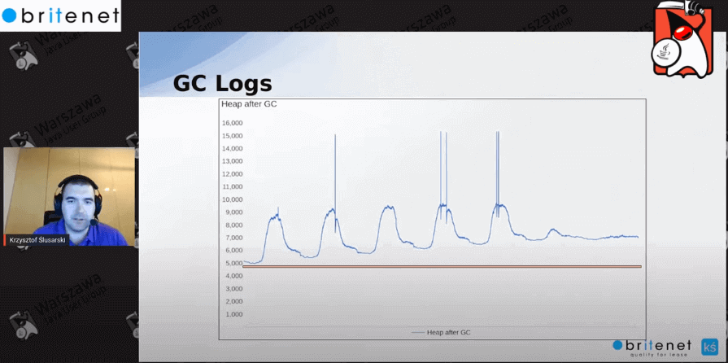

# JVM

Java Virtual Machine (JVM) is a engine that provides runtime environment to drive the Java Code or applications. It converts Java bytecode into machines language. JVM is a part of Java Runtime Environment (JRE). In other programming languages, the compiler produces machine code for a particular system. However, Java compiler produces code for a Virtual Machine known as Java Virtual Machine.

The JVM consists of three distinct components:
- Class Loader,
- Runtime Memory/Data Area,
- Execution Engine.

---

According to the Java SE specification, in order to get code running in the JVM, you need to complete three steps:
- loading bytecode from resources and creating an instance of the class
- binding (or linking)
    - According to the specification, this stage is divided into three more stages:
        - Verification , the correctness of the received bytecode is checked.
        - Preparation , allocating RAM for static fields and initializing them with default values (in this case, explicit initialization, if any, occurs already at the initialization stage).
        - Resolution , resolution of symbolic links of types, fields and methods.
- initializing the received object
    - In this phase, all static variables are assigned with their values defined in the code and static block(if any). This is executed from top to bottom in a class and from parent to child in the class hierarchy. [Reference](https://www.geeksforgeeks.org/jvm-works-jvm-architecture/)

---

Types of Java Loaders

There are three standard loaders in Java, each of which loads a class from a specific location:
- Bootstrap is a basic loader, also called Primordial ClassLoader.
  - loads standard JDK classes from the rt.jar archive
- Extension ClassLoader – extension loader.
  - loads extension classes, which are located in the jre/lib/ext directory by default, but can be set by the java.ext.dirs system property
- System ClassLoader – system loader.
  - loads application classes defined in the CLASSPATH environment variable

Java uses a hierarchy of class loaders, where the root is, of course, the base one. Next comes the extension loader, and then the system loader. Naturally, each loader stores a pointer to the parent in order to be able to delegate loading to it in the event that it itself is unable to do this.

---

References:
- https://javarush.com/en/groups/posts/en.646.how-classes-are-loaded-into-the-jvm
- https://www.freecodecamp.org/news/jvm-tutorial-java-virtual-machine-architecture-explained-for-beginners/

## When does out of memory happen?

There is a dozen of different reasons why JVM may throw OutOfMemoryError, including

- Java heap space: when trying to allocate an object or an array larger than maximum continuous free block in either of heap generations;
- GC overhead limit exceeded: when the proportion of time JVM spends doing garbage collection becomes too high (see GCTimeLimit, GCHeapFreeLimit);
- PermGen space (before Java 8) or Metaspace (since Java 8): when the amount of class metadata exceeds MaxPermSize or MaxMetaspaceSize;
- Requested array size exceeds VM limit: when trying to allocate an array with length larger than Integer.MAX_VALUE - 2;
- Unable to create new native thread: when reaching the OS limit of user processes (see ulimit -u) or when there is not enough virtual memory to reserve space for thread stack;
- Direct buffer memory: when the size of all direct ByteBuffers exceeds MaxDirectMemorySize or when there is no virtual memory available to satisfy direct buffer allocation;
- When JVM cannot allocate memory for its internal structures, either because run out of available virtual memory or because certain OS limit reached (e.g. maximum number of memory map areas);
- When JNI code failed to allocate some native resource;
- Etc. Not to mention that an application can throw OutOfMemoryError itself at any time just because a developer decides so.
- To find out what is the reason of your particular error, you should at least look at the error message, the stacktrace and GC logs.

Ref: https://stackoverflow.com/questions/33924624/when-does-out-of-memory-happen

## JVM profiling

Profiling is the process of examining an application to locate memory or performance-related issues. When profiling a Java application, you can monitor the Java Virtual Machine (JVM) and obtain data about application performance, including method timing, object allocation and garbage collection. Reference: https://docs.oracle.com/cd/E40938_01/doc.74/e40142/test_profile_japps.htm

## Java Profilers

- VisualVM
- jProfiler
- Java Mission Control
- XRebel

Reference: https://medium.com/platform-engineer/guide-to-java-profilers-e344ce0339e0

## Memory leak

There is no memory leak if the line is always the same level after running GC.

If objects are not removed from the memory, it means there is memory leak. You should notice that every GC the heap size is growing and keeping the same level as previously.

Reference: https://www.youtube.com/watch?v=Owp_BhlX7Pg&t=6984&ab_channel=WarsawJUG

### What JVM flags should be used?

Ref: <https://www.baeldung.com/jvm-tuning-flags>

Enable this flag on production: -XX:+HeapDumpOnOutOfMemoryError. It will prepare heap dump in case of critical error.

## Heap vs Swap

Heap memory is what the jvm uses, swap is what OS uses to push things not used often onto disk and save memory.

Red: https://stackoverflow.com/questions/47041855/what-is-the-difference-between-heap-and-swap-memory
