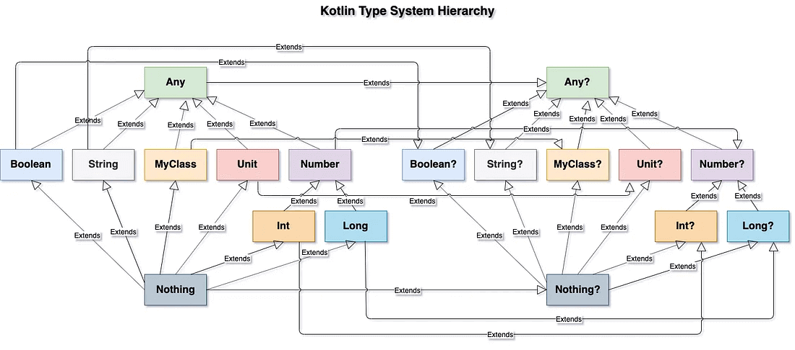

# Kotlin

> Kotlin is a multiplatform, statically typed, general-purpose programming language. Kotlin took inspiration from many programming languages, including (but not limited to) Java, Scala, C# and Groovy. One of the main ideas behind Kotlin is being pragmatic, i.e., being a programming language useful for day-to-day development, which helps the users get the job done via its features and its tools. Reference: https://kotlinlang.org/spec/kotlin-spec.html

Learning materials:
- [Learning materials overview](https://kotlinlang.org/docs/learning-materials-overview.html)
- [Kotlin Tutorial For Beginners 2023](https://www.youtube.com/watch?v=TEXaoSC_8lQ)
- [Kt. Academy / Marcin Moskała](https://kt.academy/article)
  - https://kt.academy/Kotlin_Cheat_Sheet.pdf
  - https://github.com/MarcinMoskala/advanced-kotlin-workshop-tasks

## Kotlin releases

[Top features of Kotlin releases | KOTLIN_RELEASE.md](KOTLIN_RELEASE.md)

## Compiler


[Reference1](https://kt.academy/article/ak-compiler-plugin)

[Reference2](https://github.com/ahinchman1/Kotlin-Compiler-Crash-Course)

There are two frontends, k1 and k2. K2, otherwise known as FIR frontend.

In compilers, the frontend translates a computer programming source code into an intermediate representation, and the backend works with the intermediate representation to produce code in a computer output language.

## Error hierarchy

In Kotlin, there are only unchecked exceptions that are thrown during the runtime execution of the program. All exception classes descend from the class Throwable.

Reference: https://www.baeldung.com/kotlin/exception-handling

## Data types



[Reference](https://medium.com/@m.sandovalcalvo/kotlin-type-system-unveiling-the-mystery-50613f0db893)

## Visibility modifiers

Visibility modifiers are used to control the access level of classes, functions, properties, and other members. They determine where a member can be accessed from, providing control over the encapsulation of code and reducing the chances of misuse.

| Modifier  | Description                                                                                                                                                                       | Access Level                                                           |
|-----------|-----------------------------------------------------------------------------------------------------------------------------------------------------------------------------------|------------------------------------------------------------------------|
| public    | The default visibility for classes, functions, and properties if no modifier is specified. It means the member is accessible from anywhere.                                       | Accessible everywhere (inside the same module and from other modules). |
| internal  | Makes the member visible inside the same module but not outside. This is useful for library code where you want to restrict access to certain parts of your code within a module. | Accessible within the same module.                                     |
| protected | Used in classes and subclasses. It makes the member visible to the class and its subclasses (even if they are in a different package).                                            | Accessible in the class and its subclasses.                            |
| private   | Restricts access to the member within the containing class or file.                                                                                                               | Accessible only within the class or file where it is declared.         |

## Collection literals

In Kotlin, collection literals refer to a concise and direct way to create collections (lists, sets, and maps) using built-in factory functions. Kotlin does not yet support true collection literals like array literals ([1, 2, 3]) in JavaScript or Python, but it provides easy-to-use functions for collection creation.

```kotlin
listOf(1,2,3,4) // List<Int>
mutableListOf(1,2,3,4) // MutableList<Int>

setOf("A", "B", "C") // Set<String>
mutableSetOf("A", "B", "C") // MutableSet<String>

arrayOf('a', 'b', 'c') // Array<Char>

mapOf(1 to "A", 2 to "B") // Map<Int, String>
mutableMapOf(1 to "A", 2 to "B") 

// MutableMap<Int, String>
sequenceOf(4,3,2,1) // Sequence<Int>
1 to "A" // Pair<Int, String>
List(4) { it * 2 } // List<Int>
generateSequence(4) { it + 2 } // Sequence<Int>
```

| Feature              | List                                                | Sequence                                                          |
|----------------------|-----------------------------------------------------|-------------------------------------------------------------------|
| Evaluation           | Eager (computed immediately)                        | Lazy (computed when accessed)                                     |
| Memory Usage         | Higher (stores all elements)                        | Lower (processes elements one by one)                             |
| Indexed Access       | Yes (`list[index]`)                                 | No                                                                |
| Intermediate Results | Stored in new lists                                 | Computed only when needed                                         |
| Performance          | Better for small datasets                           | Better for large datasets with multiple transformations           |
| Best Use Case        | When you need fast random access or a small dataset | When working with large datasets and chaining multiple operations |

```kotlin
val list = (1..1_000_000).toList()
val sequence = (1..1_000_000).asSequence()

// List (creates multiple intermediate lists)
val listResult = list.map { it * 2 }.filter { it % 3 == 0 }.take(10)

// Sequence (efficient, no intermediate lists)
val sequenceResult = sequence.map { it * 2 }.filter { it % 3 == 0 }.take(10).toList()

println(listResult)      // Same output
println(sequenceResult)  // Same output, but more efficient
```

## Functions

A function is a block of reusable code designed to perform a specific task.

### Function types

- () -> Unit        - takes no arguments and returns nothing (Unit).
- (Int, Int) - >Int - takes two arguments of type Int and returns Int.
- (()->Unit) -> Int - takes another function and returns Int.
- (Int)->() -> Unit - takes argument of type Int and returns function.

### Function literals

In Kotlin, function literals are expressions that represent functions without a name. These are often used for short-lived, inline functions that don't need to be defined separately. Function literals can be passed around as values, assigned to variables, or used directly in higher-order functions.

```kotlin
val add: (Int, Int) -> Int = { i, j -> i + j }
// Simple lambda expression
val printAndDouble: (Int) -> Int = {
 println(it) 
 // When single parameter, we can reference it using `it`
 it * 2 // In lambda, last expression is returned
}
// Anonymous function alternative
val printAndDoubleFun: (Int) -> Int = fun(i: Int): Int {
 println(i) // Single argument can�t be referenced by `it`
 return i * 2 // Needs return like any function
}
```


## Receiver function

A `receiver function` (or a function with receiver) in Kotlin is a function that allows you to call it as if it were a method of the receiver object. This means that within the function, you can directly access the properties and methods of the receiver object using `this`.

Receiver functions were introduced to make the code more readable and expressive, and to allow the creation of Domain-Specific Languages (DSLs) in Kotlin. They enable you to extend classes with new functionality without modifying their source code, providing a cleaner and more modular way to add methods to existing classes.

**Extension Function**:

```kotlin
fun String.sayHello(): String {
    return "Hello, $this!"
}

fun main() {
    val name = "Alice"
    println(name.sayHello())  // Output: Hello, Alice!
}
```

**Lambda with Receiver**:

```kotlin
fun buildString(builder: StringBuilder.() -> Unit): String {
    val sb = StringBuilder()
    sb.builder()
    return sb.toString()
}

fun main() {
    val result = buildString {
        append("Hello, ")
        append("world!")
    }
    println(result)  // Output: Hello, world!
}
```

```kotlin
fun sum(arr: Array<Int>): Int = arr.reduce { acc, element -> acc + element }
```

### this vs it

In Kotlin, a receiver refers to the object on which a function or property is invoked. Receivers are mainly used in extension functions and lambdas with receivers, enabling a concise and flexible way to operate on objects.

| Feature                  | Extension Function Receiver                                       | Lambda with Receiver                                                 |
|--------------------------|-------------------------------------------------------------------|----------------------------------------------------------------------|
| Definition               | Used in extension functions to refer to the object being extended | Used in lambdas where `this` refers to the object inside the lambda  |
| Keyword used             | `this`                                                            | `this` (implicit)                                                    |
| Example usage            | `fun String.addExclamation() = this + "!"`                        | `"Hello".run { println(this) }`                                      |
| Alternative reference    | Cannot use `it`                                                   | Can use `it` in some cases (e.g., `let` uses `it` instead of `this`) |
| Common functions used in | Extension functions (`fun ClassName.functionName()`)              | `apply`, `run`, `with`, `also`                                       |
| Purpose                  | Extending functionality of existing classes                       | Modifying or working with an object inside a lambda                  |

## Delegates

Delegates allow you to delegate certain functionality to another object instead of implementing it yourself. This helps in code reusability, better separation of concerns, and reducing boilerplate code. Kotlin provides two main types of delegation:
- Property Delegation
  - Property delegation allows you to delegate the getter and setter behavior of a property to another object using the by keyword.
  - Built-in Property Delegates
    - Kotlin provides some built-in property delegates, such as:
      - lazy – for initializing a property only when it's accessed for the first time. 
      - observable – for tracking changes to a property. 
      - vetoable – for validating before assigning a new value.

```kotlin
class Example {
    val name: String by lazy { 
        println("Initializing name...")
        "Kotlin"
    }
}

fun main() {
    val example = Example()
    println(example.name) // First access triggers initialization
    println(example.name) // Subsequent accesses use the stored value
}
```

```kotlin
import kotlin.properties.Delegates

class User {
    var name: String by Delegates.observable("Unknown") { _, old, new ->
        println("Name changed from $old to $new")
    }
}

fun main() {
    val user = User()
    user.name = "Alice"
    user.name = "Bob"
}
```

```kotlin
var age: Int by Delegates.vetoable(18) { _, old, new ->
    new >= 18 // Only allows setting if new value is 18 or older
}

fun main() {
    println(age)  // 18
    age = 21      // Allowed
    println(age)  // 21
    age = 16      // Not allowed, remains 21
    println(age)  // 21
}
```

- Class Delegation (Interface Delegation)
  - Instead of implementing an interface manually, you can delegate the implementation to another object using the by keyword.

```kotlin
interface Printer {
    fun printMessage()
}

class SimplePrinter : Printer {
    override fun printMessage() = println("Printing from SimplePrinter")
}

class AdvancedPrinter(printer: Printer) : Printer by printer

fun main() {
    val simplePrinter = SimplePrinter()
    val advancedPrinter = AdvancedPrinter(simplePrinter)
    
    advancedPrinter.printMessage() // Delegates call to SimplePrinter
}
```

## Variance modifiers

Variance modifiers in Kotlin (in, out) define how generic types can be used in relation to subtyping. They help manage covariance and contravariance, ensuring type safety when working with generics.

- Covariance (out)
  - Allows a generic type to be a subtype of another generic type with a supertype.
  - Declares that a type parameter can only be produced (returned) and not consumed (accepted as input).
  - Used when a generic class only produces values (e.g., List<T>).
  - Helps with subtyping (List<String> is a subtype of List<Any>).
- Contravariance (in)
  - Allows a generic type to be a supertype of another generic type with a subtype.
  - Declares that a type parameter can only be consumed (accepted as input) and not produced (returned).
  - Used when a generic class only consumes values (e.g., Comparator<T>).
  - Helps with subtyping (Comparator<Any> is a subtype of Comparator<String>).
- Invariance (Default Behavior)
  - By default, Kotlin generics are invariant, meaning no subtyping is allowed.
  - A generic type Container<T> is not a subtype of Container<S>, even if S is a supertype of T.

| Modifier    | Type Parameter Usage                                      | Variance Type     | Example Usage                                                                            |
|-------------|-----------------------------------------------------------|-------------------|------------------------------------------------------------------------------------------|
| `out`       | Can only be **produced** (returned), not consumed (input) | **Covariant**     | `List<out T>` (e.g., `List<String>` can be used as `List<Any>`)                          |
| `in`        | Can only be **consumed** (input), not produced (returned) | **Contravariant** | `MutableList<in String>` (e.g., `MutableList<Any>` can be used as `MutableList<String>`) |
| No modifier | Can be both produced and consumed                         | **Invariant**     | `Container<T>` (e.g., `Container<String>` is **not** `Container<Any>`)                   |


- Use out when you only return (produce) values.
- Use in when you only accept (consume) values.
- Use invariance (default) when a type is used both for input and output.

## Coroutines

A coroutine is an instance of a suspendable computation. It is conceptually similar to a thread, in the sense that it takes a block of code to run that works concurrently with the rest of the code.

However, a coroutine is not bound to any particular thread.
It may suspend its execution in one thread and resume in another one.

Coroutines always execute in some context that is a set of various elements.
The context is a holder of data that is needed for the coroutine. The main elements are:
- Job – models a cancellable workflow with multiple states and a life-cycle that culminates in its completion
- Dispatcher – determines what thread or threads the corresponding coroutine uses for its execution. With the dispatcher, we can confine coroutine execution to a specific thread, dispatch it to a thread pool, or let it run unconfined. Kotlin provides several implementations of CoroutineDispatcher that we can pass to the CoroutineContext.
  - Dispatchers.Default uses a shared thread pool on the JVM. By default, the number of threads is equal to the number of CPUs available on the machine.
  - Dispatchers.IO is designed to offload blocking IO operations to a shared thread pool.
  - Dispatchers.Main is present only on platforms that have main threads, such as Android and iOS.
  - Dispatchers.Unconfined doesn’t change the thread and launches the coroutine in the caller thread. The important thing here is that after suspension, it resumes the coroutine in the thread that was determined by the suspending function.

To launch a coroutine, we need to use a coroutine builder like launch or async.
These builder functions are actually extensions of the CoroutineScope interface:
- GlobalScope (async,launch)
    - The lifecycle of this scope is tied to the lifecycle of the whole application. This means that the scope will stop running either after all of its coroutines have been completed or when the application is stopped.
    - It’s worth mentioning that coroutines launched using GlobalScope do not keep the process alive. They behave similarly to daemon threads. So, even when the application stops, some active coroutines will still be running. This can easily create resource or memory leaks.
    - async is designed to perform something in the background and return a result, while launch is designed to perform an action in the background without necessarily returning a result (Just Fire It and Forget).
- runBlocking
    - It creates a scope and runs a coroutine in a blocking way.
    - This means it blocks the current thread until all children's coroutines complete their executions.
    - It is not recommended to use this scope because threads are expensive and will depreciate all the benefits of coroutines.

coroutines vs suspend functions:
- Coroutine
    - Start to finish of what happens inside a ‘scope.launch { }’.
- Suspend fun
    - A function that can suspend its own execution, a single small part of the larger coroutine.
    - It should be called only from a coroutine or another suspend function.

`Structured concurrency` refers to a way to structure async computations so that child operations are guaranteed to complete before their parents, just the way a function is guaranteed to complete before its caller. [Reference](https://ericniebler.com/2020/11/08/structured-concurrency/)

Loom vs Coroutines
- Loom can improve the performance applications: it can run multiple virtual threads and it costs less to have blocked virtual threads than to have a regular threads blocked. -Kotlin coroutines are intrusive because we cannot call suspend functions in normal function, which is not the case of Loom
- Structured concurrency is much more easier with Kotlin coroutines than Loom.
- Interoperability between Kotlin coroutines and reactive programming are more simpler as we can just use flows than the one between loom and reactive programming.
  [Reference](https://stackoverflow.com/questions/77053797/java-virtual-threads-vs-kotlin-coroutines)


References:
- https://www.baeldung.com/kotlin/threads-coroutines
- https://kt.academy/article/cc-coroutine-context
- https://www.baeldung.com/kotlin/coroutines-scope-vs-context
- https://kt.academy/article/cc-use-scope-vs-suspend
- https://medium.com/@erik.antonyan1994/understanding-structured-concurrency-in-kotlin-coroutines-5693f941a898

### Channels

Channels in Kotlin Coroutines provide a way to transfer values between coroutines safely and asynchronously.
They work like concurrent queues but are designed specifically for coroutines,
supporting suspending send and receive operations.

Why Use Channels?
- Avoid Shared Mutable State → Channels allow safe communication between coroutines.
- Producer-Consumer Pattern → Efficient data processing between sender and receiver.
- Backpressure Support → The sender suspends when the channel is full, preventing memory issues.

Types of Channels
- Rendezvous (default)	
  - No buffer, sender suspends until the receiver is ready.
- Buffered	
  - Limited-size buffer, sender only suspends when the buffer is full.
- Conflated	
  - Stores only the latest value, dropping older ones.
- Unlimited	
  - Infinite buffer, sender never suspends.
- Ticker	
  - Emits items at a fixed time interval.

When to Use Channels?
- When you need to pass data between coroutines safely.
- For producer-consumer scenarios (e.g., background tasks).
- When you need backpressure handling.

❌ Don't use channels for simple data sharing → Prefer Flow or StateFlow.

💡 Summary
- Channels allow coroutines to communicate safely.
- They support suspending send and receive operations.
- Different types: Rendezvous, Buffered, Conflated, Unlimited, Ticker.
- Use produce {} for structured producer-consumer patterns.
- Prefer Flow if you only need simple reactive streams.

#### Flow vs Channel

- Channel is used for communication between coroutines, while Flow is used for representing a stream of asynchronous data.
- Channel is hot, pushing data when available, while Flow is cold, producing data only when collected.
- Channel is more low-level, whereas Flow is a more declarative abstraction that supports transformations.

### Flow vs StateFlow

- State Management: StateFlow always holds a latest value which can be accessed synchronously, while Flow does not store values and only emits items when collected.
- Hot vs Cold: StateFlow is a hot flow that continuously emits values to collectors, while Flow is cold and starts emitting values only when it is collected.
- Updates: The value in StateFlow can be updated synchronously, while in regular Flow, data is emitted asynchronously by the producer.

In summary, StateFlow is a state-holder that allows both synchronous access to the current state and asynchronous observation of state changes. It is ideal for scenarios where you need to manage and observe a continuously updated state, such as UI-related state in an application.

### Actors

In Kotlin, actors are a powerful concept for managing concurrency and state in a safe and structured way. An actor is a coroutine that serves as a single-threaded worker, handling incoming messages in a sequential manner, which allows you to safely manage mutable state without requiring complex synchronization mechanisms like locks.

An actor is typically used to:
- Encapsulate mutable state.
- Ensure that only one coroutine can access and modify the state at a time.
- Process messages asynchronously in a non-blocking manner.

```kotlin
import kotlinx.coroutines.*
import kotlinx.coroutines.channels.actor

// Define messages that the actor will process
sealed class CounterMsg
class Increment(val value: Int) : CounterMsg()
class GetCount(val replyTo: CompletableDeferred<Int>) : CounterMsg()

// Actor that will process messages and maintain state
fun CoroutineScope.counterActor() = actor<CounterMsg> {
    var count = 0
    for (msg in channel) {
        when (msg) {
            is Increment -> count += msg.value
            is GetCount -> msg.replyTo.complete(count)
        }
    }
}

fun main() = runBlocking {
    // Launch the actor
    val counter = counterActor()

    // Send messages to the actor
    counter.send(Increment(1))   // Increment the counter by 1
    counter.send(Increment(5))   // Increment the counter by 5

    // Request the current count from the actor
    val response = CompletableDeferred<Int>()
    counter.send(GetCount(response))

    // Wait for the response and print it
    println("Current count: ${response.await()}")  // Output: Current count: 6

    // Close the actor after use
    counter.close()
}
```

## How to achieve immutability?

- Use val Instead of var (Immutable Variables)
- Use Immutable Data Classes (data class)
- Use Immutable Collections (List, Set, Map)
  - listOf(), setOf(), mapOf() → Immutable
  - mutableListOf(), mutableSetOf(), mutableMapOf() → Mutable
- Use object for Singleton Immutability
- Use @JvmInline for Inline Value Classes
- Use sealed class for Immutable State Handling (State Management)
  - Cannot be extended outside the file → Safer modeling!

## Void vs Unit vs Nothing

- Void: Represents the absence of a return value but is specific to Java.
- Unit: The Unit represents the absence of a meaningful return value. It is similar to void in Java but is a type in Kotlin. Such a function is usually performing some kind of side effect.
- Nothing: Nothing represents a type that never successfully returns. It indicates that the function either throws an exception or never completes.
    - Use Case: Used to signify functions that throw exceptions or are infinite loops. It is a type of function that never returns normally.
- Reference: <https://stackoverflow.com/questions/55953052/kotlin-void-vs-unit-vs-nothing>

```kotlin
fun fail(message: String): Nothing {
    throw IllegalArgumentException(message)
}
```

## const vs const val

- const val is used to declare compile-time constants. These constants are inlined at compile time and are fully resolved during the build process.
    - Can only be used for properties of primitive types (Int, Double, Boolean, etc.) and String that are defined at the top level or inside an object or companion object.
- In Kotlin, const is used ONLY in conjunction with val. It signifies that the value is a compile-time constant.
- Use val when the value is not known at compile time (e.g., computed dynamically).

---

Even though both are immutable, the key difference is:
- const val is inlined at compile time → Faster performance, no memory overhead
- val is a runtime constant → Stored as a variable in memory

Let's take this Kotlin code:
```kotlin
const val CONST_MESSAGE = "Hello, Kotlin!"
val VAL_MESSAGE = "Hello, Kotlin!"

fun printMessage() {
    println(CONST_MESSAGE)
    println(VAL_MESSAGE)
}
```

```java
System.out.println("Hello, Kotlin!");
```

The compiler replaces CONST_MESSAGE directly with "Hello, Kotlin!" → No memory allocation.

## @JvmStatic vs companion object

- A companion object is a special object within a class that allows you to define methods and properties that are associated with the class itself, rather than with instances of the class.
    - You use a companion object to hold static-like members, similar to static fields and methods in Java. Kotlin classes don't have static members, but you can use a companion object to achieve a similar effect.
- The @JvmStatic annotation is used to mark members of a companion object (or top-level functions) to be exposed as static methods in Java. This helps with interoperability between Kotlin and Java.
- When you annotate a member of a companion object with @JvmStatic, it will be accessible as a static member in the generated Java bytecode. This is useful when you want to call Kotlin code from Java and need static-like behavior.
- Static Access from Java:
    - Without @JvmStatic, members of a companion object are accessed through the companion object itself in Java (e.g., MyClass.Companion.someMethod()).
    - With @JvmStatic, the members are accessed directly from the class (e.g., MyClass.someMethod()).
- Ref: <https://stackoverflow.com/questions/48780003/why-and-when-to-use-jvmstatic-with-companion-objects>

