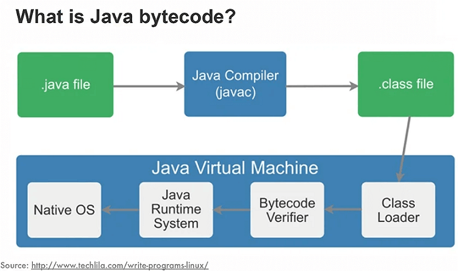
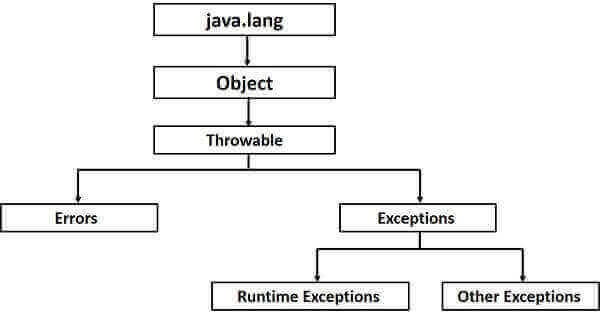
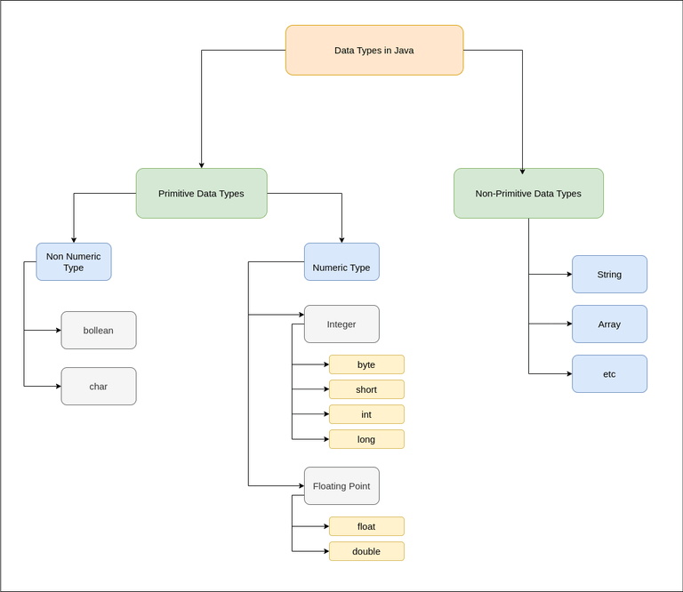
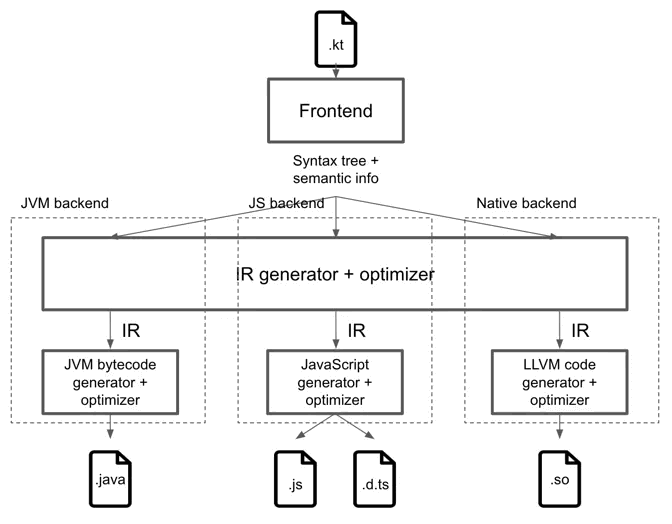

# Java & Kotlin playground

| Branch |                                                                                            Pipeline                                                                                            |                                                                                         Code coverage                                                                                          |                                       Jacoco test report                                        |                                 SonarCloud                                 |
|:------:|:----------------------------------------------------------------------------------------------------------------------------------------------------------------------------------------------:|:----------------------------------------------------------------------------------------------------------------------------------------------------------------------------------------------:|:-----------------------------------------------------------------------------------------------:|:--------------------------------------------------------------------------:|
|  main  | [](https://gitlab.com/ShowMeYourCodeYouTube/java-kotlin-playground/-/commits/main) | [](https://gitlab.com/ShowMeYourCodeYouTube/java-kotlin-playground/-/commits/main) | [link](https://showmeyourcodeyoutube.gitlab.io/java-kotlin-playground/jacoco-report/index.html) | [link](https://sonarcloud.io/organizations/showmeyourcodeyoutube/projects) |

---


Releases overview with code samples and language specific features.

Technology / Tools:
- Java
- Kotlin

Below you can find some references to interesting parts of documentation:
- [What Kotlin has that Java does not](https://kotlinlang.org/docs/comparison-to-java.html#what-kotlin-has-that-java-does-not)
- [What Java has that Kotlin does not](https://kotlinlang.org/docs/comparison-to-java.html#what-java-has-that-kotlin-does-not)

## Getting started

*Run the main method of a given module and follow printed information and examples.*

## Java

> Java is a multi-platform, object-oriented, and network-centric language that can be used as a platform in itself. It is a fast, secure, reliable programming language for coding everything from mobile apps and enterprise software to big data applications and server-side technologies.
Reference: https://aws.amazon.com/what-is/java/

### Java releases

[Top features of Java releases | JAVA_RELEASE.md](JAVA_RELEASE.md)

### Bytecode



[Reference](https://www.infoq.com/articles/Living-Matrix-Bytecode-Manipulation/)

When a Java program is compiled, bytecode is generated in the form of a .class file. This .class file contains non-runnable instructions and relies on a JVM to be interpreted.  In other words, bytecode can be defined as an intermediate code generated by the compiler after the compilation of source code. It's the instruction set for the Java Virtual Machine. [Reference](https://www.baeldung.com/java-class-view-bytecode)

The Java Virtual Machine is a virtual 'machine' that provides 
a runtime environment for Java applications and programs*.
JVM is specifically responsible for converting bytecode to machine-specific code.

*Programs are collection of instructions executed by computer. Application are programs designed for end users.

---

According to the Java SE specification, in order to get code running in the JVM, you need to complete three steps:
- loading bytecode from resources and creating an instance of the classClass
- binding (or linking)
  - According to the specification, this stage is divided into three more stages:
    - Verification , the correctness of the received bytecode is checked.
    - Preparation , allocating RAM for static fields and initializing them with default values ​​(in this case, explicit initialization, if any, occurs already at the initialization stage).
    - Resolution , resolution of symbolic links of types, fields and methods.
- initializing the received object
  - here, unlike the previous paragraphs, everything seems to be clear what should happen. It would, of course, be interesting to understand exactly how this happens.

Reference: https://javarush.com/en/groups/posts/en.646.how-classes-are-loaded-into-the-jvm

### Error hierarchy



[Reference](https://www.tutorialspoint.com/java/java_exceptions.htm)

### Data types



[Reference](https://www.geeksforgeeks.org/data-types-in-java/)

Every class in java implicitly extends java.lang.Object class. So Object class is at the top level of inheritance hierarchy in java.

[Inheritance in Java Example](https://www.digitalocean.com/community/tutorials/inheritance-java-example)

### Object identity

Objects in java are characterized by three essential properties: state, identity, and behavior. 
The state of an object is a value from its data type. 
The identity of an object distinguishes one object from another. 
It is useful to think of an object’s identity as the place where its value is stored in memory.

The state of an object is stored in fields (variables),
while methods (functions) display the object's behavior.
Objects are created at runtime from templates, which are also known as classes.

[Reference1](https://stackoverflow.com/questions/45453376/what-does-object-identity-mean-in-java)
[Reference2](https://www.techopedia.com/definition/24339/java-object)

### Project Loom

Project Loom introduces the concept of Virtual Threads to Java's runtime and will be available as a stable feature in JDK 21. [Reference](https://softwaremill.com/what-is-blocking-in-loom/)

*See more in code samples.*

## Kotlin

> Kotlin is a multiplatform, statically typed, general-purpose programming language. Kotlin took inspiration from many programming languages, including (but not limited to) Java, Scala, C# and Groovy. One of the main ideas behind Kotlin is being pragmatic, i.e., being a programming language useful for day-to-day development, which helps the users get the job done via its features and its tools. Reference: https://kotlinlang.org/spec/kotlin-spec.html

Learning materials:
- [Learning materials overview](https://kotlinlang.org/docs/learning-materials-overview.html)
- [Kotlin Tutorial For Beginners 2023](https://www.youtube.com/watch?v=TEXaoSC_8lQ)

### Kotlin releases

[Top features of Kotlin releases | KOTLIN_RELEASE.md](KOTLIN_RELEASE.md)

### Compiler



[Reference1](https://kt.academy/article/ak-compiler-plugin)

[Reference2](https://github.com/ahinchman1/Kotlin-Compiler-Crash-Course)

There are two frontends, k1 and k2. K2, otherwise known as FIR frontend. 

In compilers, the frontend translates a computer programming source code into an intermediate representation, and the backend works with the intermediate representation to produce code in a computer output language.

### Error hierarchy

In Kotlin, there are only unchecked exceptions that are thrown during the runtime execution of the program. All exception classes descend from the class Throwable.

Reference: https://www.baeldung.com/kotlin/exception-handling

### Data types


[Reference](https://medium.com/@m.sandovalcalvo/kotlin-type-system-unveiling-the-mystery-50613f0db893)

### Coroutines

A coroutine is an instance of a suspendable computation. It is conceptually similar to a thread, in the sense that it takes a block of code to run that works concurrently with the rest of the code.

However, a coroutine is not bound to any particular thread.
It may suspend its execution in one thread and resume in another one.

Coroutines always execute in some context that is a set of various elements.
The context is a holder of data that is needed for the coroutine. The main elements are:
- Job – models a cancellable workflow with multiple states and a life-cycle that culminates in its completion
- Dispatcher – determines what thread or threads the corresponding coroutine uses for its execution. With the dispatcher, we can confine coroutine execution to a specific thread, dispatch it to a thread pool, or let it run unconfined
  - Kotlin provides several implementations of CoroutineDispatcher that we can pass to the CoroutineContext
    - Dispatchers.Default uses a shared thread pool on the JVM. By default, the number of threads is equal to the number of CPUs available on the machine. 
    - Dispatchers.IO is designed to offload blocking IO operations to a shared thread pool. 
    - Dispatchers.Main is present only on platforms that have main threads, such as Android and iOS. 
    - Dispatchers.Unconfined doesn’t change the thread and launches the coroutine in the caller thread. The important thing here is that after suspension, it resumes the coroutine in the thread that was determined by the suspending function.

To launch a coroutine, we need to use a coroutine builder like launch or async.
These builder functions are actually extensions of the CoroutineScope interface:
- GlobalScope (async,launch)
  - The lifecycle of this scope is tied to the lifecycle of the whole application. This means that the scope will stop running either after all of its coroutines have been completed or when the application is stopped.
  - It’s worth mentioning that coroutines launched using GlobalScope do not keep the process alive. They behave similarly to daemon threads. So, even when the application stops, some active coroutines will still be running. This can easily create resource or memory leaks.
  - async is designed to perform something in the background and return a result, while launch is designed to perform an action in the background without necessarily returning a result (Just Fire It and Forget).
- runBlocking
  - It creates a scope and runs a coroutine in a blocking way.
  - This means it blocks the current thread until all children's coroutines complete their executions.
  - It is not recommended to use this scope because threads are expensive and will depreciate all the benefits of coroutines.

coroutines vs suspend functions:
- Coroutine
  - Start to finish of what happens inside a ‘scope.launch { }’.
- Suspend fun
  - A function that can suspend its own execution, a single small part of the larger coroutine.
  - It should be called only from a coroutine or another suspend function.

`Structured concurrency` refers to a way to structure async computations so that child operations are guaranteed to complete before their parents, just the way a function is guaranteed to complete before its caller. [Reference](https://ericniebler.com/2020/11/08/structured-concurrency/)

Loom vs Coroutines
- Loom can improve the performance applications: it can run multiple virtual threads and it costs less to have blocked virtual threads than to have a regular threads blocked. -Kotlin coroutines are intrusive because we cannot call suspend functions in normal function, which is not the case of Loom
- Structured concurrency is much more easier with Kotlin coroutines than Loom.
- Interoperability between Kotlin coroutines and reactive programming are more simpler as we can just use flows than the one between loom and reactive programming.
[Reference](https://stackoverflow.com/questions/77053797/java-virtual-threads-vs-kotlin-coroutines)


References:
- https://www.baeldung.com/kotlin/threads-coroutines
- https://kt.academy/article/cc-coroutine-context
- https://www.baeldung.com/kotlin/coroutines-scope-vs-context
- https://kt.academy/article/cc-use-scope-vs-suspend
- https://medium.com/@erik.antonyan1994/understanding-structured-concurrency-in-kotlin-coroutines-5693f941a898


### Receiver function

A `receiver function` (or a function with receiver) in Kotlin is a function that allows you to call it as if it were a method of the receiver object. This means that within the function, you can directly access the properties and methods of the receiver object using `this`.

Receiver functions were introduced to make the code more readable and expressive, and to allow the creation of Domain-Specific Languages (DSLs) in Kotlin. They enable you to extend classes with new functionality without modifying their source code, providing a cleaner and more modular way to add methods to existing classes.

**Extension Function**:

```kotlin
fun String.sayHello(): String {
    return "Hello, $this!"
}

fun main() {
    val name = "Alice"
    println(name.sayHello())  // Output: Hello, Alice!
}
```

**Lambda with Receiver**:

```kotlin
fun buildString(builder: StringBuilder.() -> Unit): String {
    val sb = StringBuilder()
    sb.builder()
    return sb.toString()
}

fun main() {
    val result = buildString {
        append("Hello, ")
        append("world!")
    }
    println(result)  // Output: Hello, world!
}
```

```kotlin
fun sum(arr: Array<Int>): Int = arr.reduce { acc, element -> acc + element }
```
